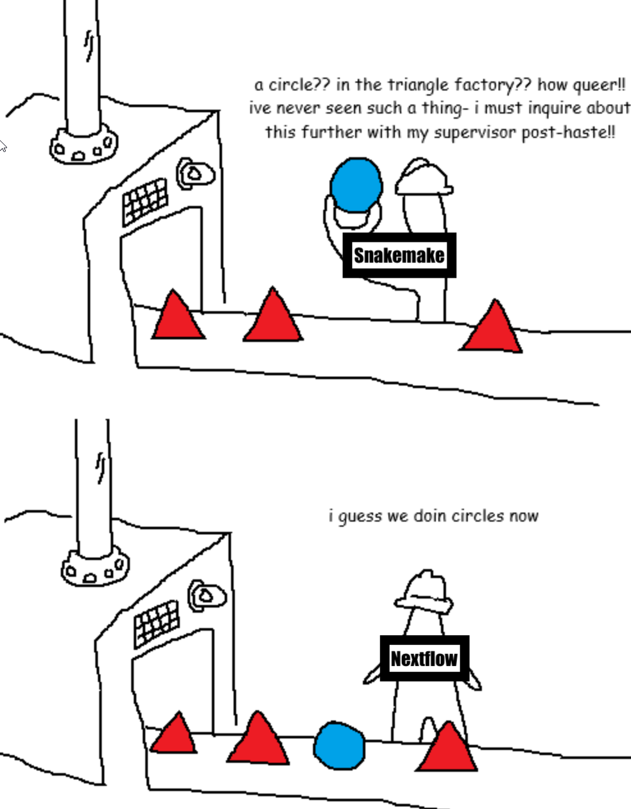
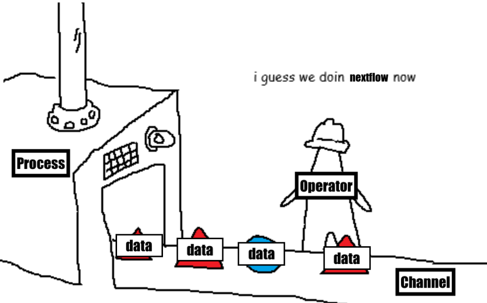

# Nextflow Workshop, part 2: Writing workflows

## Introduction

Welcome to the second part of our Nextflow workshop! In this section, we will learn how to begin creating a Nextflow workflow from a series of shell scripts. We will learn about what types of workflows might benefit from being converted to Nextflow, how to go from a series of shell scripts to a pipeline, and how to make a pipeline configurable so that it can be used with different datasets. Keep in mind that this session is designed to give you a taste of developing Nextflow workflows, and uses a very simple example. If you want assistance with turning your own workflow into a Nextflow workflow, please reach out to us for help!

!!! warning "Run `git pull` at the beginning of the workshop"

    Because we have been making changes to the workshop content, if you have cloned the [workshop repository :octicons-link-external-24:](https://github.com/harvardinformatics/nextflow-workshop){ target="_blank" }  before today, please run `git pull` in the root directory of the repository to make sure you have the latest version of the materials. If you downloaded the materials as a zip file, please redownload the zip file and extract it again. **If you've made modifications to any of the files, you can delete your changes with `git reset --hard HEAD` before running `git pull`. Or you can clone the repository again.**

## What workflows are suitable for Nextflow?

Although we love workflow managers like Nextflow, that doesn't mean that every single time we're running something on our computers we are wrapping them in a Nextflow script. A workflow manager has the following powerful features:

* **Resumability**: If a step in a workflow fails, you can rerun from that step.
* **Reproducibility**: You can rerun the same workflow with the same input data and get the same results.
* **Parallelization**: You can run multiple steps in parallel, and subsequent steps run without waiting for unrelated steps to finish.
* **Scalability**: Running the same workflow for 1 or 100 files is the same

However, there is a good amount of overhead involved in writing a Nextflow pipeline, so in order to take advantage of these features, you may also ask whether your workflow has some of the following characteristics:

* **Multiple, interrelated steps**: If you have multiple file transformations that depend on each other, this is a good candidate for Nextflow. Don't use Nextflow if you have just one or two simple steps that are easily launched in a shell script.
* **Need for reruns**: If you need to rerun the same steps with different parameters (e.g. for benchmarking), or if you need to compare the results of different runs, Nextflow could help make this easier and more reproducible.
* **Can benefit from simple parallelization**: You have many independent steps that can be run in parallel, such as multiple input files to be processed with the same steps
* **Complex dependencies across steps**: Each process in Nextflow can run in a different environment, so this would be useful if you want to compartmentalize your software environments

A classic example of a workflow that would NOT be worth converting into a Nextflow workflow is some one-off exploratory or data cleaning script that you aren't sure you will ever run again. Another example is a super convoluted workflow that you don't fully understand or didn't write yourself, and don't have time to debug. In that case it might be better to just start fresh rather than trying to convert. 

## Should you write a Nextflow workflow or a Snakemake workflow?

Some of you may have taken our Snakemake workshop, or have experience with Snakemake already. Both Nextflow and Snakemake are powerful workflow managers, and both have their strengths and weaknesses. Here are some considerations to help you decide which one to use:

| Snakemake | Nextflow |
|-----------|----------|
| Written in python | Written in Groovy (Java)
| Syntax is simpler | More complicated syntax
| Simpler features -> easier to debug | More features -> harder to debug
| Used frequently in academia | Used frequently in industry
| Smaller userbase/community | Larger userbase/community
| Limited documentation & training | Extensive documentation & training
| modules (decentralized and not maintained) | nf-core (centrally curated and maintained)

In summary, in our opinion it is easier to get started with Snakemake, but Nextflow offers more powerful features and a larger community for support. Additionally, Snakemake the software is not developed as thoughtfully as Nextflow, often introducing breaking changes across versions, so it may be more difficult to maintain Snakemake workflows in the long term. However, Nextflow is more difficult to learn initially and it is run by a commercial entity (Seqera Labs). If you write a workflow in either Snakemake or Nextflow, you will be well positioned to convert it to the other workflow manager in the future if needed.

If you want to quickly get something started in a workflow manager, Snakemake may be the better choice. If you want to learn something that will help you write production-grade workflows and may be more broadly applicable in the job world, Nextflow is worth the learning curve. 

Alternatively, you can refer to this meme:
<div>
    <input type="checkbox" id="popup" style="display:none;">
    <div class="backdrop" onclick="popup.checked=false;">
      <label for="popup">
        
      </label>
    </div>
</div>


## Converting shell scripts to Nextflow workflows

### Drawing your own rulegraph

Planning ahead is important when writing a Nextflow workflow. Before you start writing any code, you should understand the relationships between the different steps in your workflow. One way to do this is to visualize the rulegraph of your workflow manually.

> **Exercise:** Read through the shell script files in the `shell-scripts` directory. These scripts take a set of text files in the `data` directory, count the number of lines and words in each file, and then combine those counts into a summary file for each input file. Draw a diagram of the input-output relationships of these scripts. For example, you might draw something like this:

```
data/sample1.txt  -->  01_count_lines.sh  -->  results/sample1.lines
```

> Or it may be easier to draw on paper.


### Understanding Nextflow channels

Let's take a look at how we can read in the samplesheet using Nextflow channels. Channels are a core concept in Nextflow, and they are used to pass data between processes. A channel can be thought of as a stream of data that can be consumed by one or more processes. Imagine a channel as a bucket or a conveyer belt that holds data. You can manipulate and order the data in a channel using various operators provided by Nextflow.

Channels are a powerful but difficult concept in Nextflow that doesn't really have any analog in other programming that we've seen before. The reason Nextflow has channels is so that users can do complex file manipulations and pass data between processes without having to write processes to take care of these low-level non-computational tasks. Unlike Snakemake, Nextflow does not operate solely on files, but rather on streams of data that can be files or other types of data, so channels are how data flow is managed. 

Let's learn how to create a channel that reads in the input `samplesheet.txt` file and prints out each line. Create a new file called `01_fromPath.nf` and add the following code:

```nextflow title="01_fromPath.nf" linenums="1"
#!/usr/bin/env nextflow

workflow {
    // Create a channel that reads in the samplesheet & does some operations
    samples = Channel.fromPath('samplesheet.txt')
        .splitText()
        .map { sample -> sample.trim() }
        .map { sample -> file("data/${sample}.txt")}

    
    // Print out each object in samples
    samples.view()
}
```

In nextflow syntax, the `.` indicates that we are calling an operator on the channel created in the previous line. Here, we create a channel using the `Channel.fromPath()` operator, which reads in the file at the specified path. We then use the `.splitText()` operator to split the text file into lines, creating a channel of lines. This channel of lines is assigned to the variable `samples`. Finally, we use the `.view()` operator to print out each item in the channel.

> **Demonstration:** As an demonstration we can comment out using `//` each line after the `Channel.fromPath()` line, and run the script using `nextflow run 01_fromPath.nf` to see how the output changes as we add more operators.


??? example "Command breakdown"

    | Command | Description |
    |---------|-------------|
    | `Channel.fromPath('samplesheet.txt')` | Creates a channel from the file path `samplesheet.txt` |
    | `.splitText()` | Splits the text file into lines and creates a channel of lines |
    | `.map { sample -> sample.trim() }` | Trims whitespace from each line in the channel (removes the newline character at the end) |
    | `.map { sample -> file("data/${sample}.txt")}` | Maps each line to a file path. The `file()` function converts the string to a file object, which allows for file manipulations methods|
    | `samples.view()` | Prints out each item in the channel |

#### Channel factories

The `.fromPath()` is an example of a channel factory, which is a special type of operator that creates a new channel. You can think of these as different shapes of buckets or conveyer belts that hold data, with each one having some specialized way of treating the data. 

Here are some other [channel factories](https://nextflow.io/docs/latest/reference/channel.html) you might find useful:

| Factory | Description |
|---------|-------------|
| `Channel.fromPath('path/to/file')` | Creates a channel from a file path |
| `Channel.fromFilePairs('data/*.fastq')` | Creates a channel of file pairs based on a glob pattern, and files are emitted as tuples where the first item is the common prefix and the second item is the list of two fastq files |
| `Channel.of(item1, item2, item3)` | Creates a channel from a list of items |
| `Channel.fromList([item1, item2, item3])` | Creates a channel from a list |
| `Channel.fromSRA(['SRA_ACCESSION1', 'SRA_ACCESSION2'])` | Creates a channel from a list of SRA accessions and returns the FASTQ files matching the accessions|

Besides using factories, processes also emit data in the form of channels. Usually, you will be using channels created by processes rather than creating channels from factories directly. The exception is when you are reading in input data, such as in the example above.

> **Exercise:** Try modifying the code above to use `Channel.fromList()` instead of `Channel.fromPath()`. You can create a list of strings that represent the lines in the samplesheet, and see if you can get the same output. *Hint: You can manually type in the file path as a list of strings, or you can use the same `.map{}` operator as we used in `01_fromPath.nf` to convert strings to file objects.*

??? example "Solution"

    See solution in `solutions/02_fromList.nf`

#### Channel operators

We've already seen a few channel operators in the code above: `.splitText()`, `.map{}`, and `.view()`. Here are some other common channel operators you might find useful:

| Operator | Description |
|----------|-------------|
| `combine()` | Emit the combination of two channels |
| `splitText()` | Splits a text file into lines and creates a channel of lines
| `map {}` | Transforms each item in the channel using a closure |
| `filter {}` | Filters items in the channel based on a condition |
| `collect()` | Collects all items in the channel into a list |
| `view()` | Prints out each item in the channel |

For a full list of channel operators see the [Nextflow documentation :octicons-link-external-24:](https://www.nextflow.io/docs/latest/reference/operator.html#operator-page){ target="_blank" }.

Operators can use either `{}` or `()` at the end. Operators use `{}` to define a **closure**, which is a custom logical expression. Operators that use `()` only do not require a closure but can take **arguments** inside the parentheses. For example the `.map {}` operator requires a closure to define how to transform each item in the channel, while the `.combine()` operator can take arguments like another channel or a `by` parameter on how to combine the channels.

There is a helpful github repo of common patterns using Nextflow channels that you can refer to. See [this link](https://nextflow-io.github.io/patterns/). 

**Exercise:** Read the [Process per CSV record](https://nextflow-io.github.io/patterns/process-per-csv-record/) and create a new file called `03_splitCsv.nf`. Write a `workflow` that reads in the `samplesheet.csv` file and prints out each record using the `.view()` operator. The printout should be the full file path of each sample (enclosed in `file()`), not the relative path in the csv.

??? example "Solution"

    See solution in `solutions/03_splitCsv.nf

**Bonus:** Experiment with removing the `file()` wrapper and see what happens. Maybe add an extra line to the samplesheet with a non-existent file path.

### Adding process `COUNT_LINES` - Writing your first Nextflow process

We will now use the workflow written in `03_splitCsv.nf` file going forward. Now that we have a channel that reads in the samplesheet, let's write our first Nextflow process to count the number of lines in each input file. 

First, copy the contents of `03_splitCsv.nf` into a new file called `04_count_lines.nf`. Next, we will define a process called `COUNT_LINES` that takes in the input file path and counts the number of lines in the file using the `wc -l` command. Your process call should look something like this:

```nextflow title="04_count_lines.nf" linenums="1"
#!/usr/bin/env nextflow

process COUNT_LINES {

    publishDir 'results', mode: 'copy'

    input: 
    path input_file

    output: 
    path "${input_file.baseName}.lines"

    script:
    """
    wc -l ${input_file} | awk '{print \$1}' > ${input_file.baseName}.lines
    """
}
```

Now let's do a more detailed breakdown of the process definition. 

A process typically consists of the following sections: 

* `publishDir:` (optional) defines where to save the output files. In our case, we want it saved in a folder named `results` in the current working directory. The `mode: 'copy'` argument copies the files from the `work` directory to the `results` directory. The default mode is `link`, which creates a symbolic link to the file in the `work` directory. 
* `input:` defines the inputs to the process. A process must contain at least one input section and each input needs to have a *qualifier* and a *name*. Common qualifiers are `path`, which causes a file to be staged properly, and `val`, which is some value that can be accessed in the script section. 
* `output:` defines the outputs of the process. Similar to inputs, each output needs a *qualifier* and a *name*. Outputs can have dynamic names using the `${}` syntax, where the value inside the curly braces typically refers to an input variable.
    * In our `path` output, we use `${}` to access the value stored in `input_file` from the input and pass it to the the output file name. 
    * Because the `input_file` is a file object, we can use the `.baseName` method to get the file name without the extension. This way, if the input file is `/path/to/data/sample1.txt`, the output file will be named `sample1.lines`.
* `script:` defines the the script executed by the process and is be default a bash script enclosed in triple quotes (`"""`). To access nextflow variables/pipeline parameters inside the script, use the `${}` syntax. If you need to access a literal dollar sign (`$`), such as in `awk` commands, you need to escape it using a single backslash (`\`), e.g. `\$1`. If you need to access system variables such as `$HOME`, you need to escape the dollar sign with a backslash (`\`), e.g. `\$HOME`.
    * In our example, we use the `wc -l` command to count the number of lines in the input file and redirect the output to a new file named `${input_file.baseName}.lines`. This has to match the `output` declaration or it will throw an error. 

Alright, we've got the process defined, and we've got the workflow definition copied over from before. Let's try running the workflow with `nextflow run 04_count_lines.nf`.

#### Calling a process in the workflow

Just because we have the process, doesn't mean that it will be run. We need to call the process like a function in the `workflow` definition section. In the `workflow` section we needs to create the `samples` channel as before, but then instead of just viewing the channel, we need to pass it to the `COUNT_LINES` process. 

```nextflow title="04_count_lines.nf" linenums="19"
workflow {
    // Create a channel that reads in the samplesheet
    samples = Channel.fromPath('samplesheet.csv')
        .splitCsv(header:true)
        .map { row -> file(row.filePath) }
    
    // Print out each record in the samplesheet
    samples.view()

    COUNT_LINES(samples)

    COUNT_LINES.out.view()
}
```

### Conceptual overview of channels, processes, and workflows



Think of channels as conveyer belts that connect processes together. Operators are like little workers sorting and filtering the data on a conveyer belt. Passing the correct channel to the process is how we "call" the process to be executed. The output of the process is another channel (conveyer belt). You can access the output channel of a process using the `.out` property of the process.

### Testing your workflow

#### Checking for syntax errors with `nextflow lint`

Now that we have a working process and workflow definition, we should test it to see if it works as expected. As you are writing your pipeline, it can be useful to use the `nextflow lint` command to check for syntax errors and formatting issues. We have a sample erroneous Nextflow script called `errors.nf` that you can use to test the linting command.

Run the following command in your terminal:

```bash
nextflow lint errors.nf
```

> **Exercise:** Run `nextflow lint errors.nf` and identify the errors in the script. Once there are no more errors, try running `nextflow lint errors.nf -format` to automatically fix the formatting issues in the script. 

??? example "Solution"

    The solution to the errors.nf is the same as the `solutions/04_count_lines.nf` file.

#### Previewing the workflow DAG

You can preview the workflow DAG directly in the VSCode editor if you have the Nextflow extension installed. Open the `04_count_lines.nf` file and click on the "Preview DAG" button in the top of the `workflow` section. This will open a window showing a DAG of the workflow. Right now, it's only a single process so there will only be one box/node in the DAG.

You can also generate a DAG without running the workflow by using the `-preview` and `-with-dag` flags when running the workflow. Run the following command in your terminal:

```bash
nextflow run 04_count_lines.nf -preview -with-dag workflow_dag.png
```

You'll notice that this command generates a file that includes the channel names and operators, which can be useful for debugging, but it can also make the DAG cluttered and hard to read. 

### Exercises

In the next few sections, we will gradually out our Nextflow workflow based on the bash scripts in the `develop/shell-scripts` directory. We will name them `05_count_words.nf`, `06_combine_counts.nf`, etc. We will be publishing the output files of each process in the `results` directory. In practice, this would clutter your project directory, particularly if you use the `mode: 'copy'`, but it's fine for now. As we test and run our Nextflow workflows, we will be removing the `results` directory and its contents each time. This is so that we can see the output of each workflow clearly. 

#### Adding process `COUNT_WORDS`

> **Exercise:** Copy the contents of `04_count_lines.nf` into a new file called `05_count_words.nf`. Add a new process called `COUNT_WORDS` that takes in the sample list channel and counts the number of words in each input file. When you add this new process, make sure to call it in the `workflow` section. Viewing the output with `.out.view()` is optional. 

??? success "Checkpoint"

    See solution in `solutions/05_count_words.nf`

#### Revising processes to preserve metadata in channels

In our previous `COUNT_WORDS` and `COUNT_LINES` processes, we only passed in the file paths as inputs and outputs. This works fine for now, but as we add more processes to the workflow, it will become difficult to keep track of which output file corresponds to which sample. This is an issue because `COUNT_LINES.out` and `COUNT_WORDS.out` are channels that emit files **in the order they complete** (which may vary due to parallel execution). Therefore, there needs to be a way to tag each output file with its corresponding sample name. We can do this by passing in the sample name as a `val` input to each process, and then including it in the output as well.

Where do we get the sample name? In our `samplesheet.csv` file, we have both the sample name and the file path. So we can modify our initial channel creation to create a channel of **tuples**, where the first element is a string that contains the sample name and the second element is a `path` that contains the file path.

```nextflow linenumes="1"
workflow {
    samples = Channel.fromPath('samplesheet.csv')
        .splitCsv(header:true)
        .map { row -> tuple(row.sampleName, file(row.filePath)) }
    ...
}
```

!!! question "What is a tuple?"

    A `tuple` is a data structure that is like an immutable list, or a list with rules. The elements in a tuple can be different types, but the content and order of the elements in a tuple cannot be changed after it is created. For the purposes of learning Nextflow, you can think of them as a basket of related data. 

Now that we have a channel of tuples, we need to modify our processes to take as input and output tuples as well. We can use the `tuple` qualifier in the `input:` and `output:` sections of the process to start with. Then, for each item in the tuple we need to specify the qualifier with `()` syntax, separated by commas. For example, in our case, the first element will be `val(sample_name)`, and the second element will be `path(input_file)`. `sample_name` and `input_file` are variable names and can be anything you want.

```nextflow linenums="1"
process COUNT_LINES {
    
    input:
    tuple val(sample_name), path(input_file)

    output:
    tuple val(sample_name), path("${sample_name}.lines")
    ...
}
```

> **Exercise:** Copy the contents of `05_count_lines.nf` into a new file called `06_counting_with_metadata.nf`. Incorporate this change in the `workflow` section to create an input channel of tuples. Then modify the `COUNT_LINES` and `COUNT_WORDS` process to take in a tuple as input and output a tuple as well. This should not change the actual file outputs of the processes. But do make sure to view the output of both processes using `.out.view()` to see the difference in output.

> **BONUS Exercise:** Now that we have the sample name preserved, we can use it in output file names and in our script section. Modify `COUNT_LINES` and `COUNT_WORDS` to use `${sample_name}` instead of `${input_file.baseName}`.

Look at the below for an example of how `05_count_words.nf` output should differ from `06_counting_with_metadata.nf` output.

First script:

```title="Output" linenums="1"
executor >  local (2)
[ba/163bd1] COUNT_LINES (1) [100%] 2 of 2 ✔
/../nextflow_workshop/develop/work/17/a7922d4378d328df6a74ec0558e292/sample1.lines
/../nextflow_workshop/develop/work/ba/163bd1279533ec8369cd890a43587b/sample2.lines
```

Second script:

```title="Output" linenums="1"
[bb/779082] COUNT_LINES (1) [100%] 2 of 2 ✔
[sample1, /../nextflow_workshop/develop/work/bb/7790822842b5bba6c53c69b286332a/sample1.lines]
[sample2, /../nextflow_workshop/develop/work/f9/bc69d54beb8a9506bba3e9bac306f3/sample2.lines]
```

**How this differs from Snakemake:**

In Snakemake, the input and output of a rule are always files, and the file names are what is used to keep track of which sample corresponds to which output. This is because Snakemake operates on a pull-based model, where all files are determined beforehand and each file is pulled backwards from the final output. In Nextflow the data (not only files) is "pushed" through the workflow, and the output is not determined until runtime. Therefore, Nextflow needs to be explicit about passing data and metadata together. 

#### Adding process `COMBINE_COUNTS`

The next shell script we want to add to our Snakemake workflow is the `03_combine_counts.sh` script, which will combine the line and word counts for each sample into a single output file for each sample. This rule will take as an input the line and word count files for each sample. The final output will now be a `.summary` file for each sample. As before, we will need to edit both `workflow` as well as add the new `process COMBINE_COUNTS`. Additionally, we will have three inputs for the `COMBINE_COUNTS` process: the sample name, the line count file, and the word count file. 

> **Exercise:** 
>
> 0. Copy the contents of `06_counting_with_metadata.nf` into a new file called `07_combine_counts.nf`. 
> 1. Modify the `workflow` section to combine the output channels of `COUNT_LINES` and `COUNT_WORDS` using the [join](https://nextflow.io/docs/latest/reference/operator.html#join) operator. Use the `.view()` operator to see what the output of the join looks like. You can save this channel to a new variable called `joined_ch`. 
> 2. Add a new process called `COMBINE_COUNTS` that takes in the sample name, line count file, and word count file as inputs, and outputs a summary file for each sample.

Run the workflow and check that the output files are correct. Use the preview DAG feature to see how the workflow looks now with three processes.

??? question "Hints"

    * To check that your join is working correctly, add a `.view()` operator and run the workflow with `-resume`. 
    * Here's a checklist of the directives you should have in your `COMBINE_COUNTS` process:
        * `publishDir:` should be the same as the other processes
        * `input:` should have three items in a tuple: sample name, line count file path, and word count file path
        * `output:` should have two items in a tuple: sample name and the summary file path
        * In the `script:` section, think about how to adapt the bash code from `03_combine_counts.sh`. You only need to copy over lines 7-10 from the original bash script. Make sure to substitute the variable names with the Nextflow variable names. 
    * Remember to call the `COMBINE_COUNTS` process in the `workflow` section, passing in the `joined_ch` channel.

??? success "Checkpoint"

    See solution in `solutions/07_combine_counts.nf`

#### Adding process `AGGREGATE`

We will now move on the writing the final process in our workflow, which is to aggregate all the summary files into a single file called `aggregate-summary.tsv`. This will adapt the bash script `04_aggregate.sh`. This script takes all the `.summary` files and combines them into a nice tab-separated file (TSV) with a header. So far we have written processes that take one or two defined inputs and produce one output, based on each sample. Because we've been doing per-sample processing we've had to carry over all the sample metadata. However, this final process will take an undefined number of input files (all the `.summary` files) and produce a single named output file. So at this point, we don't care about the sample names anymore. 

Since this is a different type of process, let's break down how to write it.

> **Question:** What is the input to this process?

??? success "Answer"

    The input is all the `.summary` files that have been produced. We don't have to enumerate them all, we just need to pass them all in as a channel. The channel will be a list of file paths, so the input will be `path summary_files`.

> **Question:** Based on the shell script, what should the output be?

??? success "Answer"

    The output is a single file called `aggregate-summary.tsv`. So the output will be `path 'aggregate-summary.tsv'`.

> **Question:** How do we modify the shell script to work in Nextflow?

??? success "Hint"

    We need to modify the shell script in two ways. 

    1. We need to convert one variable to a nextflow variable, and that is the declaration of the for loop. Instead of using `for file in results/*summary`, we can use `for file in ${summary_files}`. 
    2. The rest of the script uses bash variables, but the `$` signs need to be escaped with a backslash (`\`).

??? success "Answer"

    Here is the final script section:

    ```nextflow
    script:
    """    
    echo -e "sample\tlines\twords" > aggregate-summary.tsv
    
    for sample in ${summary_files}; do
        SAMPLE_NAME=\$(basename "\$sample" .summary)
        LINES=\$(cat "\$sample" | grep -e "^lines\t" | cut -f2)
        WORDS=\$(cat "\$sample" | grep -e "^words\t" | cut -f2)
        echo -e "\$SAMPLE_NAME\t\$LINES\t\$WORDS" >> aggregate-summary.tsv
    done
    """
    ```

Converting the process wasn't too difficult. But now we need to change the workflow section to call this process. The correct way to do this is to use the `.collect{}` operator on the output of `COMBINE_COUNTS`. The [collect operator](https://nextflow.io/docs/latest/reference/operator.html#collect) collects all items from a source channel into a list and emits it as a single item. You can use a closure (aka an anonymous function) to apply any transformations to each item before collecting them. In our case, we are only interested in collecting the second item in the tuple emitted by `COMBINE_COUNTS`, so we can use a closure to drop the first item (the sample name).

```nextflow linenums="1"
workflow {
    /** 
     ... 
     previous code
     ...
    **/
    collected_ch = COMBINE_COUNTS.out.collect{sample_name, summary_file -> summary_file}
    collected_ch.view()
    AGGREGATE(collected_ch)
}
```

!!! note "`collect()` does not sort the items"

    The `collect()` operator does not sort the items in the channel, so you will get the items in the order that they were emitted by the channel. If you need to sort the items, you can use the `sort()` operator before `collect()`.

Putting it all together, your final workflow should look like `08_aggregate.nf` in the `solutions` directory. Run the workflow and check that the output file `aggregate-summary.tsv` is correct.

??? success "Checkpoint"

    See solution in `solutions/08_aggregate.nf`

Congratulations! You've now successfully converted a series of shell scripts into a Nextflow workflow! In the next sections, we will learn some more advanced topics that will help you write production-ready workflows. 

## Customizing your Nextflow pipeline

### Running on a cluster

So far, our script will not work on the Cannon HPC cluster. To run on an HPC, we need to specify the executor in a config file. By default, the executor is set to `local`, but we want it to be `slurm` for Cannon so that jobs are submitted to the SLURM scheduler.

In the previous workshop, we used a pre-made config file called `cannon.config` that was customized for Cannon. Let's take a look at what is inside, so that you may be able to write your own config for other clusters in the future. 

[link to cannon.config file](https://nf-co.re/configs/cannon/)

The important part of the config file is the `executor` directive, which is set to `slurm` under the `process` block. This sets the default behavior to submit jobs to the cluster. Then, the `queue` directive is set to the available partitions based on the resources that are being used by each process. Importantly, the `serial-requeue` partition is not used in this config because the Nextflow head job does not support requeuing jobs. The partition names and restrictions are specific to each HPC cluster, which is why each cluster needs its own config file.

### Resources

Resource management is crucial when running your workflow on the cluster. If it is unspecified, SLURM will used default resources for that HPC. On Cannon, the default resources for jobs is 10 minutes, 1 core, and 100 MB of memory, which is too low for most jobs.

Resources can be specified in the `process` block of the main Nextflow script using the `cpus`, `memory`, and `time` directives. For example:

```nextflow title="main.nf" linenums="1"
process EXAMPLE {
    cpus 4
    memory '8 GB'
    time '2h'
    ...
}
```

However, hardcoding resource values is not ideal. If you want to make a modular workflow that other people can run, you should create a config file that specifies resources for each process. This way, other users can modify the resources without having to edit your `.nf` file. 

Within a config file, there are a few ways to specify resources for processes. 

**Specify global resources for all processes:**

```nextflow title="nextflow.config" linenums="1"
process {
    cpus = 2
    memory = '8 GB'
    time = '2h'
}
```

**Specify resources for a specific process:**

```nextflow title="nextflow.config" linenums="1"
process {
    withName: EXAMPLE {
        cpus = 4
        memory = '8 GB'
        time = '2h'
    }
}
```

**Specify resources for multiple processes using tags/labels:**

```nextflow title="nextflow.config" linenums="1"
process {
    time = '2h'  // default time for all processes
    cpus = 2    // default cpus for all processes
    withLabel: high_memory {
        memory = '32 GB'
    }
    withLabel: low_memory {
        memory = '4 GB'
    }
}
```

And then in the process definition, you can add the label like this:

```nextflow title="main.nf" linenums="1"
process EXAMPLE {
    label 'high_memory'
    ...
}
```

Finally, you can also **specify dynamic resources** using process variables. For example, you can set the memory based on the size of the input file:

```nextflow title="main.nf" linenums="1"
process EXAMPLE {
    // check if input_files is a list. If list, allocate 2GB per file. Else allocate 2GB.
    memory { input_files instanceof List ? input_files.size() * 2.GB : 2.GB }
    
    input:
    path input_files
    
    output:
    path 'some_output.txt'

    script:
    """
    some_command ${input_files}
    """
}
```

### Error strategies

Often when running on a cluster, jobs may fail due to temporary/stochastic issues, such as network problems, node issues, etc. Individual processes may also fail if that particular instance runs out of time or exceeds memory limits. By default, if a process fails, it sends a signal to terminate the workflow and pending jobs (even if unrelated) are killed. 

Nextflow allows you to specify retry/error strategies for processes that fail so that it can be automatically resubmitted if it fails, or it can be ignored. Just like with resources, you can specify error strategy directly in the process or in the config file. Here are some examples of error strategies I have used:

**Ignore a failed process**

```nextflow title="main.nf" linenums="1"
process EXAMPLE {
    errorStrategy 'ignore'
    ...
}
```

**Retry up until maximum maxRetries times. Otherwise, ignore**

```nextflow title="main.nf" linenums="1"
process EXAMPLE {
    errorStrategy { task.attempt <= maxRetries ? 'retry' : 'ignore' }
    ...
}
```

**Retry with more resources up until maxRetries if exit status is in 137..140**

```nextflow title="main.nf" linenums="1"
process EXAMPLE {
    memory { 2.GB * task.attempt }
    time { 1.hour * task.attempt }

    errorStrategy { task.exitStatus in 137..140 ? 'retry' : 'terminate' }
    ...
}
```

**More complicated retry with exponential backoff & custom error message**

I used this retry strategy when I was trying to download FASTQ files from SRA. Some of the accessions only contained forward or reverse reads, so I created a custom exit status of `99` to indicate that the download was incomplete and to not continue to the next step for this sample. I also implemented exponential backoff to avoid running into network issues when trying to mass download files. 

```nextflow title="main.nf" linenums="1"
process fetch_SRA {
  // this error strategy ignores SRAs where one fastq is corrupted and does not download
  errorStrategy {
    sleep(Math.pow(2, task.attempt) * 200 as long)
    if (task.exitStatus == 99) {
      return 'ignore'
    } else if (task.attempt==maxRetries){
      return 'ignore'
    }
    return 'retry'
  }
  maxRetries 2
  input:
    val sraid
  output:
    tuple val(sraid), path('*_1.fastq'), path('*_2.fastq')
  shell:
    """
     fastq-dump  --clip --skip-technical --maxSpotId 2000000 \\
     --defline-seq '@\$sn/\$ri' --defline-qual '+\$sn/\$ri' --split-files ${sraid}

    if [ -e "${sraid}_1.fastq" ] && [ -e "${sraid}_2.fastq" ]; then
      true
    else
      exit 99
    fi
    """
}
```

If you have a massively parallel workflow with many samples, it can be helpful to initially ignore failed processes and then use `-resume` to rerun only the failed processes after inspecting the errors. 

## Software environments with Nextflow

Another important component of a workflow is software dependencies. So far, we have been using basic bash, but in practice, we will be using specific software tools and libraries. One of the benefits of workflow managers is that you can specify a totally separate software environment for each rule, including different versions of software or even different programming languages. 

### Conda

!!! alert "Remember to enable conda"

    If you want to use conda environments, remember to enable conda by running `nextflow run -with-conda` or adding `conda.enabled = true` in your config file.

You can use the `conda` directive in the process block in a few ways. The first way is to specify a list of package names to be installed. 

```nextflow title="main.nf"
process EXAMPLE {
    conda 'fastqc trimmomatic=0.36 bioconda::bwa=0.7.15'
    ...
}
```

In the above example, conda will create an environment with the latest version of `fastqc`, version `0.36` of `trimmomatic`, and version `0.7.15` of `bwa` from the bioconda channel.

Another way to specify conda environments is to use a conda environment file, formatted as a yaml file. A yaml file is a plain text file organized into key-value pairs that conda can use to create an environment. You can write a yaml file yourself like this:

```yaml linenums="1"
name: my_env_name
channels:
  - conda-forge
dependencies:
  - pandas=1.3.0
  - numpy=1.21.0
  - scikit-learn=0.24.2
```

Or you can export an existing conda environment to a yaml file using the command `conda env export --name my_env_name --file my_env_name.yaml`. Either way, put this yaml file in your project directory and then reference it in the `conda` directive like this:

```nextflow title="main.nf" linenums="1"
process EXAMPLE {
    conda 'my_env_name.yaml'
    ...
}   
```

The major benefit of using this yaml file is that it will always travel with your project so that it essentially makes the environment documented and portable. By specifying the version numbers of each software package, you can better ensure that your workflow will have consistent behavior. 

### Singularity/Docker

!!! alert "Remember to enable singularity"

    If you want to use singularity containers, remember to enable singularity by running `nextflow run -with-singularity` or adding `singularity.enabled = true` in your config file.

On the cluster, we also have the option of using container images. Containers are a way of packaging all the requirements of a software into one image file. Containers are run by software called Docker or Singularity. You can usually find container images on dockerhub or the biocontainers registry. Here is an example of a rule using the software `mafft` from the biocontainers registry.

```nextflow title="main.nf" linenums="1"
process EXAMPLE {
    container "biocontainers/mafft:7.475--hdfd78af_0"
    input:
    path input_fasta
    output:
    path output_fasta
    shell:
        "mafft {input} > {output}"  
}
```

## More channel examples

One of the things that makes Nextflow both powerful and difficult to learn intitially is the syntax involved in channels and their operators. In this section, we will practice some more channel examples to showcase how data flow can be manipulated in Nextflow for more complex workflows.

### Keeping metadata with meta map

In our previous example, we used tuples to pass the sample name along with the file path through the workflow. This worked fine for one value of metadata, but what if we had a whole table of metadata that we wanted to keep track of? We can bundle all the metadata into a map/dictionary-like structure using key-value pairs. 

Recall that in our previously finished script `08_aggregate.nf`, we created the initial channel like this:

```nextflow linenums="1"
workflow {
    samples = Channel.fromPath('samplesheet.csv')
        .splitCsv(header:true)
        .map { row -> tuple(row.sampleName , file(row.filePath)) }
}
```

Now let's imagine that our samplesheet had more columns, such as the following:

```title="metadata/samplesheet.csv"
sampleName,animal,mod,filePath
sample1,turkey,uppercase,data/sample1.txt
sample2,tux,uppercase,data/sample2.txt
sample3,moose,duplicate,data/sample3.txt
```

We want to preserve all the metadata and separate it out from the file path. We can do this by nesting a list of the key-value pairs inside the tuple:

```nextflow linenums="1"
workflow {
    samples = Channel.fromPath('samplesheet.csv')
        .splitCsv(header:true)
        .map { row -> 
            tuple(                              // this spacing is optional
                [                               // just to make thing readable
                    sampleName: row.sampleName, // make sure the row.<col_name> matches csv header
                    animal: row.animal,         // key can be anything you want
                    mod: row.mod
                ], 
                file(row.filePath)
            )
        }
    samples.view()
}
```

Move to the `develop/metadata` directory and run the `main.nf` file there with the command `nextflow run main.nf -with-conda`. There will be some commented out sections in the workflow that we will uncomment as we go along. For now, running the `main.nf` file should print the following:

```title="Output" linenums="1"
N E X T F L O W   ~  version 25.04.6

Launching `main.nf` [voluminous_perlman] DSL2 - revision: 4a401acec7

[[sampleName:sample1, animal:turkey, mod:uppercase], /path/to/develop/metadata/data/sample1.txt]
[[sampleName:sample2, animal:tux, mod:lowercase], /path/to/develop/metadata/data/sample2.txt]
[[sampleName:sample3, animal:moose, mod:duplicate], /path/to/develop/metadata/data/sample3.txt]
```

As you can see, each item in the channel is a tuple consisting of a list of key-value pairs (the metadata) and a file path. Let's look at the `COWPY` process to see how we can access the metadata.

```nextflow title="main.nf" linenums="1"
process COWPY {

    publishDir 'results', mode: 'copy'

    conda 'envs/cowpy.yaml'

    input:
    tuple val(meta), path(input_file)

    output:
    tuple val(meta), path("${meta.animal}_mod-${meta.mod}.txt")

    script:
    """
    cat ${input_file} | cowpy -c ${meta.animal} > ${meta.animal}_mod-${meta.mod}.txt
    """
}
```

In the `input:` section, we use `val(meta)` to access the metadata list, and `path(input_file)` to access the file path. In the `output:` section, we use `${meta.animal}` and `${meta.mod}` to access the values in the metadata list. Similarly, in the `script:` section, we use `${meta.animal}` as a parameter value for the `cowpy` command, so that we can make different "cowacters" based on the metadata. 


### Filtering channels

So far, we haven't done anything with the "mod" column in the samplesheet. It would be nice if we could apply different transformations to the text file based on the value of the "mod" column. So far, we've only seen workflows where each file goes through the same set of processes. But with the power of channels operators and metadata, we can create more branching paths for our data. 

The primary operator we will use for this is the [filter](https://nextflow.io/docs/latest/reference/operator.html#filter) operator. Looking at the documentation, you will see that there are a lot of ways to filter a channel. For example, you can use a regular expression to filter strings, you can filter based on the type (like Number or File), or you can use a closure `{}` (aka anonymous function) to filter based on any condition you want. We'll use the last method to filter based on the value of the `meta.mod` value. 

To do that, we can take our samples channel `ch_samples` and use the dot syntax to apply the `filter{}` operator. Inside the closure, we break out the `meta` and `file` items from the tuple, and then check if `meta.mod` matches (`==`) the desired value. We then use the `view()` operator to print out the filtered channel.

```nextflow linenums="1"
workflow{
    ...
    ch_samples.filter { meta, file -> meta.mod == 'duplicate' }
        .view()
}
```

Now let's comment out the `COWPY(ch_samples)` and uncomment the rest of the workflow.

In our actual workflow, we create three filtered channels, one for each value of `meta.mod`. Then we pass each filtered channel to a different process that applies the desired transformation. We also have a slightly fancier `view()` operator call that makes the console look nicer. After we've done the transformations, we then combine all the channel outputs using the `mix()` operator and pass that to the `COWPY` process. 

Rerun the full `main.nf` workflow now to see how the filtering works. `nextflow run main.nf -with-conda`

!!! note "Other things to note about filtering"

    * The `filter{}` operator does not change the original channel. It creates a new channel that only contains the items that pass the filter condition. Therefore, you can reuse the original channel multiple times to create different filtered channels.
    * You can rename the filtered channel in-line by using the `.set{}` operator. For example `channel.of(10, 20, 30).set { my_channel }` is equivalent to `my_channel = channel.of(10, 20, 30)`.

Looking over our final workflow, including the processes, you can see how clean the inputs and outputs are for each process. Each process gets the same inputs, and each transformation process has the same output structure. The important manipulations of files occurs in the workflow section using channel operators, rather than in the process definition. In this way, the processes are modular and reusable and the workflow is more flexible. 

## Seqera platform demo

In this section, we will give a brief demo of the Seqera platform, which is a commercial platform for running Nextflow workflows. One of the ways in which Seqera commercializes Nextflow is by providing a web-based platform for running and monitoring Nextflow workflows. However, if we provide the hosting ourselves (using our own HPC), we can still take advantage of the web-based monitoring features of Seqera. To use it, we need to first get the API key from our Seqera account (which can just be your GitHub account or you can create a separate one with an email). Then, we need to add the API key to our Nextflow config file. In my case, I added it to my `.bashrc` so that it is always available and will never get accidentally committed to a public repo. Then, we can simply run any workflow with the `-with-tower` flag to enable remote monitoring. 

## Additional topics/questions?


