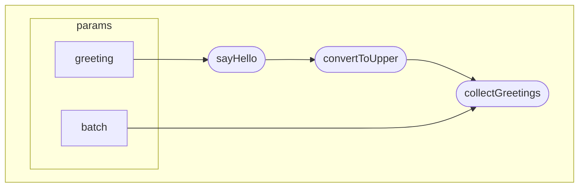

## README for hello-nextflow-simple

This is the repo for our tool hello-nextflow-simple! This tool takes a CSV of greetings, converts them to upper case and saves each greeting as its own text file.



### Installation

There are no additional installation requirements other than nextflow. To install nextflow, 

1. first check that you have java 17 or higher

```bash
java -version
```

2. enter this command in your terminal

```bash
curl -s https://get.nextflow.io | bash
```

### Inputs

The CSV of greetings must be formatted with one greeting per line. This is a single column CSV. Example below:

```
Hello
Bonjour
Nihao
```

Do NOT put the greetings as separate columns:

```
Hello, Bonjour, Nihao
```

### How to run

You can run this on the default demo data using the command `nextflow run main.nf`. If you would like to supply your own csv of gretings you can run this using the command `nextflow run main.nf --greeting your-csv.csv`