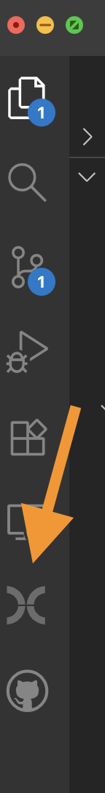
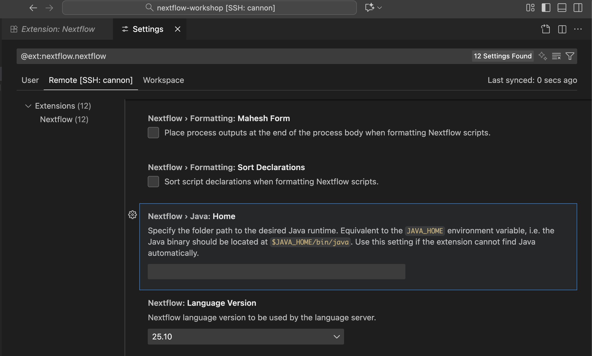
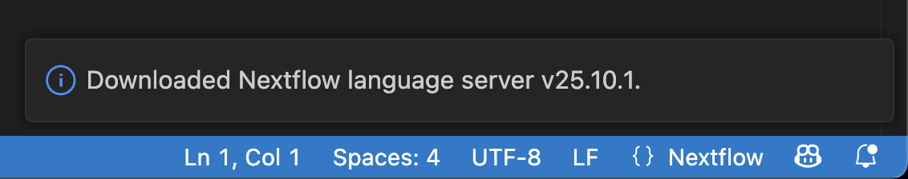

# Introduction to Nextflow

{{ author_row(page) }}

This is a two session workshop intended to introduce analysts to the workflow scripting language [Nextflow :octicons-link-external-24:](https://www.nextflow.io/docs/latest/index.html){ target="_blank" }. Workflow management systems, such as Nextflow, allow one to create reproducible and scalable data analysis pipelines. In the first session, we will cover the basics of **running** a Nextflow workflow. In the second session, we'll learn the basics of **writing and developing** a Nextflow workflow from scratch. This will aid those who wish to convert their analyses to workflows.

## Prerequisites

While we do not require attendees to have previous experience writing Nextflow scripts, this is an intermediate level workshop, so some computational experience is required:

- Basic knowledge of navigating a file system from the command line
- Previous experience with command line software and ability to read basic bash scripts
- Experience editing text files
- Basic understanding software environments (*e.g.* conda) and containers (*e.g.* singularity)

!!! warning "Cluster account required"

    Additionally, since this workshop will involve exercises on the Cannon cluster, a [Cannon account through FASRC is required :octicons-link-external-24:](https://docs.rc.fas.harvard.edu/kb/quickstart-guide/){ target="_blank" }. Be sure you can login to the cluster **BEFORE CLASS**.

## Getting Started

This workshop will use files hosted on a [github repository :octicons-link-external-24:](https://github.com/harvardinformatics/nextflow-workshop){ target="_blank" } that you will need to download to the Cannon cluster. You will then be editing these files during the workshop using VSCode with the Nextflow extension installed. In order to edit these files and run them on the cluster, you will ssh VSCode to the cluster using the Remote - SSH extension. You'll have to install the extension in the cluster codespace.

### Downloading the workshop

First, login to the cluster and navigate to the location in which you want to download the repo. 

#### 1. If you are familiar with `git`

If you'd like to use the `git` command line tool, you can clone the repo as follows:

```bash
git clone https://github.com/harvardinformatics/nextflow-workshop.git
cd nextflow-workshop
```

??? example "Code breakdown"

    | Code                                                                     | Description |
    | ------------------------------------------------------------------------ | ----------- |
    | `git clone https://github.com/harvardinformatics/nextflow-workshop.git` | This uses `git` to make a copy (clone) of our workshop directory, specified by the URL. |
    | `cd nextflow-workshop`                                                  | This changes your working directory to the newly cloned directory. |

#### 2. If you'd rather not use `git`

You can also just download the repository archive directly and extract it:

```bash
wget https://github.com/harvardinformatics/nextflow-workshop/archive/refs/heads/main.zip
unzip main.zip
cd nextflow-workshop-main
```

??? example "Code breakdown"

    | Code                                                                                        | Description |
    | ------------------------------------------------------------------------------------------- | ----------- |
    | `wget https://github.com/harvardinformatics/nextflow-workshop/archive/refs/heads/main.zip` | This uses the `wget` tool to download a compressed copy of our workshop repo, specified by the URL. |
    | `unzip main.zip`                                                                            | This decompresses the workshop directory.
    | `cd nextflow-workshop-main`                                                                | This changes your working directory to the newly downloaded workshop directory. |

### Installing Nextflow

#### Using the Nextflow self-installer

We recommend installing nextflow globally using their self-installer script and putting it in your PATH. Nextflow a software that runs on Java. Before installing Nextflow on the cluster, make sure to load the Java module. Navigate to where you want to install nextflow, such as your home directory, a software directory in your lab, or somewhere else in your PATH. 

```bash
module load jdk
curl -s https://get.nextflow.io | bash
```

To check your installation, run the "Hello world" example:

```bash
nextflow run hello
```

#### Installing Nextflow in a conda environment

You can also install nextflow in a conda environment. Depending on how your conda is configured, you want to use Option 1 or Option 2 below. 

**Option 1: Using the cluster's conda module**

If you don't already have conda or mamba installed, you will have to load the cluster modules. First, check if they are installed by typing either `conda` or `mamba` into the command line. If you see a help menu, you are good to continue. 

If you see any variation of the error `command not found`, you will have to load the modules with the following:

```bash
module load python
```

??? example "Code breakdown"

    | Code     | Description |
    | -------- | ----------- |
    | `module` | Run the cluster's module tool for pre-installed software. |
    | `load`   | The sub-command to run to load a given module. | 
    | `python` | The name of the module to load. |     

Then, if you check which modules are loaded with `module list` you should see:

```
Currently Loaded Modules:
  1) Miniforge3/25.3.1-fasrc01   2) python/3.12.11-fasrc01
```

Miniforge3 is the module that contains `conda`

**Option 2: Using your own conda installation**

If you already have conda/mamba installed and don't use the cluster's module, feel free to use that! Just follow the appropriate instructions below for activating your environments (or do it how you normally do it).

**Creating an environment with Nextflow**

```bash
conda create --name nf-env bioconda::nextflow
source activate nf-env
# confirm it is installed correctly
nextflow run hello
```

### Working with text files on the cluster

During this workshop we will be writing scripts and editing text files on the cluster. For nextflow in particular, we recommend you use the editor [VSCode :octicons-link-external-24:](https://code.visualstudio.com/){ target="_blank" }. This is because there is a nextflow extension that provides syntax highlighting and other useful features. Additionally, VSCode has the ability to create ssh or tunnel to the cluster so that you can edit files on the cluster directly from your local VSCode application. Below are the steps to finalize the setup.

1. Download and install [VSCode :octicons-link-external-24:](https://code.visualstudio.com/){ target="_blank" } if you don't have it already.
2. Install the [Remote - SSH extension](https://marketplace.visualstudio.com/items?itemName=ms-vscode-remote.remote-ssh){ target="_blank" } and the [Remote Explorer extension](https://marketplace.visualstudio.com/items?itemName=ms-vscode-remote.remote-explorer){ target="_blank" } in VSCode.
4. Follow the instructions on the [FASRC docs](https://docs.rc.fas.harvard.edu/kb/vscode-remote-development-via-ssh-or-tunnel/){ target="_blank" } to connect to the Cannon cluster. We recomment using method 3 (ssh). 
5. Once connected to the cluster, install the [Nextflow extension](https://marketplace.visualstudio.com/items?itemName=nextflow.nextflow){ target="_blank" } in the cluster codespace.
6. Use File > Open Folder... to open the `nextflow-workshop` directory you downloaded earlier.
7. If you are using the conda installation method for Nextflow, be sure to activate your conda environment using the terminal.

### Confirm that the setup is working/troubleshooting setup

When you have completed the above steps, you should at some point see that there is a nextflow icon on the left side of VSCode



If you do not see the above, confirm that you are using VSCode connected to the cluster and that you have installed the Nextflow extension in the cluster codespace. Cluster extensions are separate from your local extensions.

You should also be able to open up a `.nf` file and see syntax highlighting and a "Preview DAG" button at the top of the workflow section of the script. 


If you do not see the above but you do have the Nextflow extension installed and activated, you may be seeing an error on the bottom right of your VSCode that says something like "Java 17 or later is required to use the Nextflow language server". Here's how to fix that.

**If you did the auto-installer**, make sure you activate java using the command `module load jdk`. Then open the command palette (Cmd+Shift+P on Mac, Ctrl+Shift+P on Windows/Linux) and type "Nextflow: Restart Language Server". 

**If you used conda** to install nextflow, go to your settings (File > Preferences > Settings) and search for "Nextflow". In your terminal, make sure you have activated your nextflow conda environment and run the command `echo $JAVA_HOME` to get the path to your java installation. Copy the **absolute path** to the Java: Home setting for the Nextflow extension PLUS `/lib/jvm`. For example if your `JAVA_HOME` is `/n/home14/username/.conda/envs/nf-env/`, you want to copy `/n/home14/username/.conda/envs/nf-env/lib/jvm` into the Java: Home setting. 



You should then see a little popup on the bottom right that says "Downloaded Nextflow language server".



## Workshop content

:material-calendar-clock: Links to content will appear as the date of each session approaches!

Click the buttons below to access the workshop content.


<!--#### [Part 1: Running a Nextflow workflow](run/){ .md-button .md-button--primary .centered }

#### [Part 2: Developing a Nextflow workflow](develop/){ .md-button .md-button--primary .centered } -->
