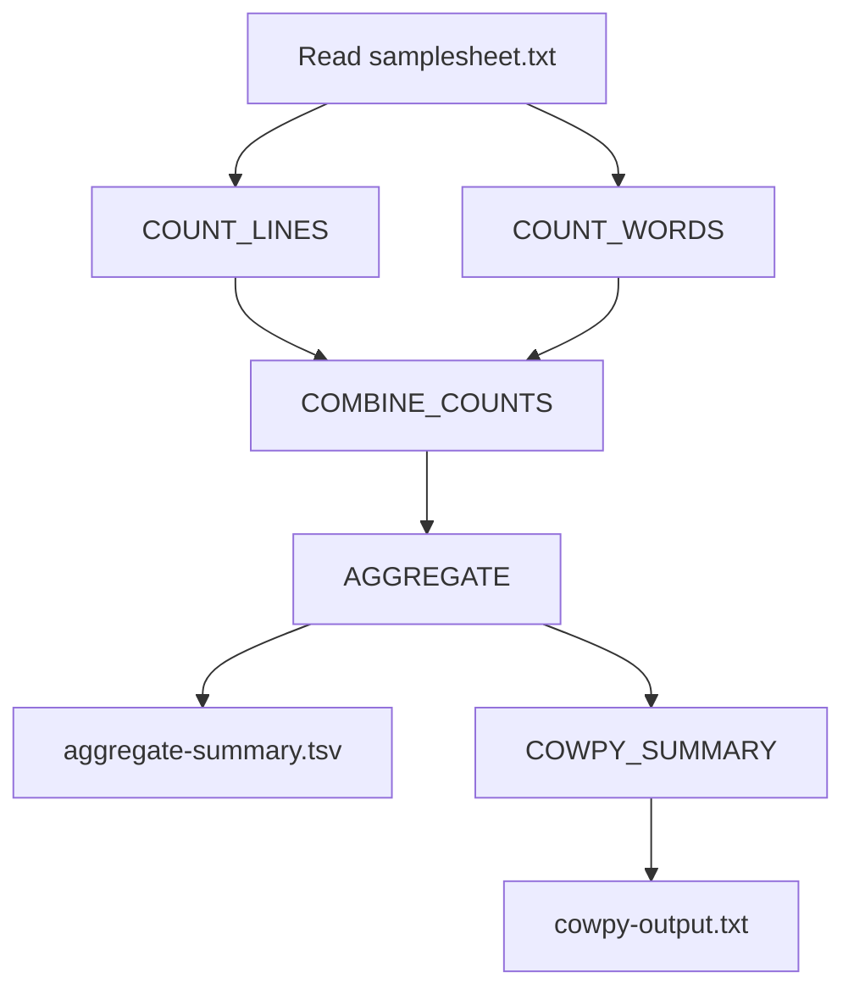

## README for hello-nextflow-simple

This workflow processes a set of text files, counts the number of lines and words in each file, summarizes these counts per sample, and generates an aggregated summary table.

### Workflow Overview

Given a `samplesheet.txt` listing sample IDs (one per line), and a directory of input text files (one file per sample, named `<sample_id>.txt` in the `data/` directory), the workflow:

1. Counts the number of lines in each sample file.
2. Counts the number of words in each sample file.
3. Combines the line and word counts for each sample into a summary file.
4. Aggregates all sample summaries into a single `aggregate-summary.tsv` table.
5. Summarizes the samples processed using `cowpy`.
6. Provides pipeline info reports (timeline, report, race, and the pipeline dag).

### Flowchart



### Installation

You only need [Nextflow](https://www.nextflow.io/) and [Conda](https://docs.conda.io/) (for dependencies).

1. Check that you have Java 17 or higher:

    ```bash
    java -version
    ```

2. Install Nextflow:

    ```bash
    curl -s https://get.nextflow.io | bash
    ```

### Inputs

- **samplesheet.txt**: Plain text file with one sample ID per line.
- **data/**: Directory containing input files named `<sample_id>.txt` for each sample.

Example `samplesheet.txt`:
```
sample1
sample2
```

Example `data/` directory:
```
data/
├── sample1.txt
└── sample2.txt
```

### How to run

Run the workflow with default parameters:

```bash
nextflow run main.nf
```

To specify custom input locations:

```bash
nextflow run main.nf --samplesheet your_samplesheet.txt --input_dir your_data_dir --outdir your_results_dir
```

### Configuration

This pipeline can be run with either `conda` or `docker`. By default, it uses `docker`. To change to `conda` mode, run using the `-profile conda` option:

You can enable or disable specific steps using parameters:
```groovy
    run_lines = true
    run_words = true
    run_aggregate = true
```

Or use the provided parameter json files `params-minimal.json` or `params.json`. 

### Outputs

- Per-sample summary files: `results/<sample_id>.summary`
- Aggregated summary table: `results/aggregate-summary.tsv`
- Cowpy output file: `results/cowpy-output.txt`
- Pipeline info reports: `results/pipeline_info/` (timeline, report, trace, dag)
