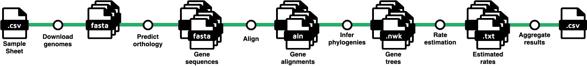
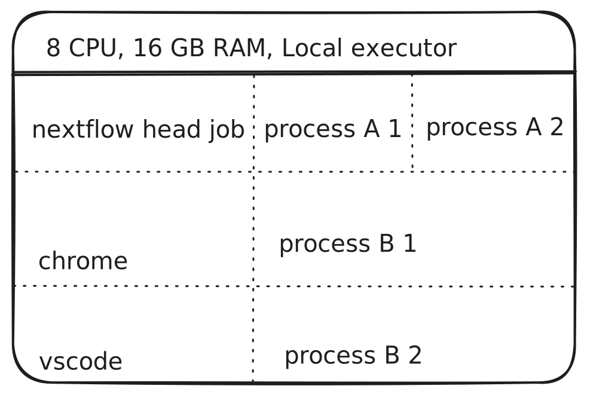
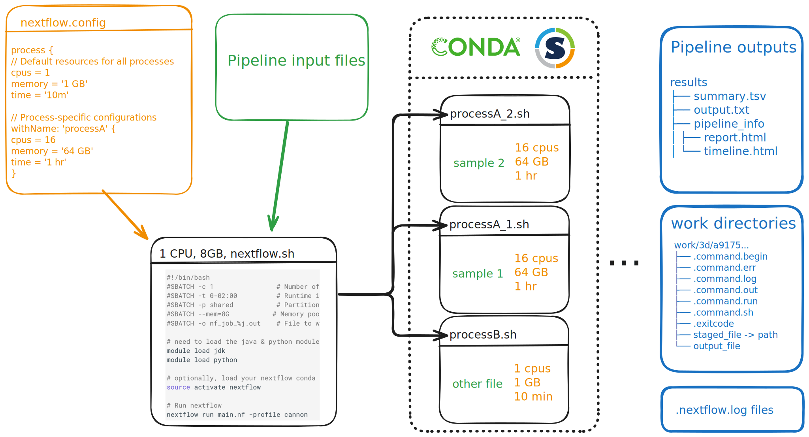

# Nextflow Workshop, part 1: Running Workflows

## Introduction

Welcome to the first part of our workshop on workflow managers with Nextflow. This is day 1 or 2 where we will focus on learning how to install, run, and troubleshoot pre-existing Nextflow pipelines. We'll touch on the basics of Nextflow syntax and terminology, configuration options, and how to run Nextflow on the FASRC Cannon HPC. 

If you haven't already, please follow the [Getting Started](../index.md) section to download the workshop materials and install Nextflow, as well as choose a text editor to work with on the cluster.

!!! warning "Run `git pull` at the beginning of the workshop"

    Because we have been making changes to the workshop content, if you have cloned the [workshop repository :octicons-link-external-24:](https://github.com/harvardinformatics/nextflow-workshop){ target="_blank" }  before today, please run `git pull` in the root directory of the repository to make sure you have the latest version of the materials. If you downloaded the materials as a zip file, please redownload the zip file and extract it again.

### Terminology

Before we get started teaching any workshop, I like to point out that, like any specific domain, the way we talk about programming is almost its own language. Words in this context may have different meaning than in other contexts. As programmers ourselves, we are so used to using words in the context of programming that we sometimes forget others aren't used to it.

This is all to say, if you hear us saying a word that you're familiar with but it's obvious that we're using it in a different way, or if you hear an unfamiliar term, please ask us to explain it. This knowledge gap is one of the most difficult parts about teaching a specific topic mostly because the teachers aren't usually aware of it.

We've put together a table of terms relating to Snakemake and workflows and their definitions in this context: [Workflow terminology](https://informatics.fas.harvard.edu/resources/glossary/#workflow-management).

There are also other tables to browse on the glossary. Please let us know if there is anything you think we should add to this table.

What do we mean when we say **workflow**? Well, let's picture some typical steps for a phylogenomic analysis:

1. Download genomes of interest and their annotations
2. Extract annotated regions of each genome (*e.g.* longest transcript from of each gene) and predict orthology between transcripts of different species
3. Align orthologous sequences
4. Filter poorly aligned sequences
5. Create a phylogeny for each aligned gene
6. Assess rates of evolution across gene trees

Or:



This visualization of a workflow is called a **rule graph**. In this image, the sheafs of paper represent files (annotated with their file extensions) and the circles represent computational actions performed on those files (annotated with the description of that action). 

You can see that each of these steps requires input files, produces output files, and likely has an associated piece of software or a custom script written by the researcher. These steps and the tools associated with them are your analytical workflow - **the output of one step becomes the input of the next step**.

Importantly, each step needs to be done for each sample or gene or other discrete analysis element. For steps 1 and 2, you may have to run whatever tool you use for every sample in your data set, maybe dozens or even hundreds of times. For steps 3-7, you may have to run whatever tool you use for every gene in your analysis, possibly thousands of times.

Let's take a look at a single step, (3) align orthologous sequences. If we use a common program, such as [MAFFT :octicons-link-external-24:](https://en.wikipedia.org/wiki/MAFFT){ target="_blank" }, which aligns a single sequence at a time, what are our possible solutions to automate this for our potentially thousands of sequences?

### A bash script for every step

One of the most common ways to automate analyses prior to workflow languages was the use of custom shell scripts. A **shell** is the program behind the text interface on your terminal, with `bash` being one of the most common shells for Unix-like OSes. Shells themselves are like mini-programming languages, giving users the power to write code and commands to customize their environment. With that being said, one could write a **bash script** that loops over every unaligned sequence file in a directory, runs an alignment program on it, and saves the output:

```bash
#!/bin/bash

for locus in /path/to/loci/*.fasta
do
    locus_base=$(basename "$locus" .fasta)
    mafft "$locus" > /path/to/alignments/"$locus_base".fasta
done
```

??? example "Code breakdown"

    | Code                                                       | Description |
    | ---------------------------------------------------------- | ----------- |
    | `#!/bin/bash`                                              | The syntax of using `#!` at the beginning of a script is called a 'shebang'. When placed at the beginning of a script, the path following is the path to the program that should interpret the script (in this case, bash). |
    | `for locus in /path/to/loci/*.fasta`                       | This tells bash to loop over every file that has a `.fasta` file extension in the `/path/to/loci/ directory`. It assigns the current file name to the variable `locus`. |
    | `do`                                                       | Bash keyword for defining code blocks. |
    | `locus_base=$(basename "$locus" .fasta)`                   | This uses the basename command to store the filename as a string without the `.fasta` extension. |
    | `mafft "$locus" > /path/to/alignments/"$locus_base".fasta` | This runs mafft on the current locus file and stores the resulting alignment using the same filename in a different folder. |
    | `done`                                                     | Bash keyword for ending code blocks. |

One might (and should) save this set of commands as a script for reproducibility, possibly calling it something like `03_run_mafft.sh`. That way when you look back at your analysis, you'll be able to easily remember what commands you ran and be able to run them again if needed.

Of course, this is just one step in our workflow. We would likely need a script for each step: `01_download_samples.sh`, `02_extract_genes.sh`, ... and so on. Then we'd have to run them each individually and deal with individual errors, or perhaps write a meta-script that runs each of them sequentially as a sort of pseudo-workflow script.

There are two problems with this approach:

1. High maintenance
2. Difficult to parallelize

### Job arrays

**Job arrays** can help with the parallelization problem. A job array is a feature of most modern **job schedulers** that are installed on institutional clusters. A job scheduler is a program that handles user requests for resources and allocates compute nodes based on resources available. On the Cannon cluster at Harvard, we use the [SLURM :octicons-link-external-24:](https://slurm.schedmd.com/overview.html){ target="_blank" } job scheduler.

In a typical SLURM job, you would write a SLURM script to submit a request to run some command on a compute node:

```bash
#!/bin/bash
#SBATCH --cpus-per-task=1
#SBATCH --mem=1G
#SBATCH --time=00:10:00

mafft locus1.fa > alignments/locus1.aln
```

??? example "Code breakdown"

    | Code                                      | Description |
    | ----------------------------------------- | ----------- |
    | `#!/bin/bash`                             | The syntax of using `#!` at the beginning of a script is called a 'shebang'. When placed at the beginning of a script, the path following is the path to the program that should interpret the script (in this case, bash). |
    | `#SBATCH --cpus-per-task=1`               | When a script is submitted as input to SLURM, lines that begin with `#SBATCH` are interpreted as SLURM options. This one specifies how many CPU are requested per task. |
    | `#SBATCH --mem=1G `                       | When a script is submitted as input to SLURM, lines that begin with `#SBATCH` are interpreted as SLURM options. This one specifies how much memory should be allotted for the job. |
    | `#SBATCH --time=00:10:00`                 | When a script is submitted as input to SLURM, lines that begin with `#SBATCH` are interpreted as SLURM options. This one specifies how much time is requested to run the job. |
    | `mafft locus1.fa > alignments/locus1.aln` | This runs mafft on a single file and saves the result to a file with redirection (`>`). |

Here, the `#SBATCH` comments give information to the SLURM scheduler. **Job arrays** allow us to scale this up, running multiple inputs on the same command, in parallel if resources are available.

For a job array, in the context of aligning sequences, you would first create a text file that just lists the paths to the input sequences. This is sometimes called a **manifest** file:

```
loci/locus1.fasta
loci/locus2.fasta
loci/locus3.fasta
...
loci/locus1453.fasta
```

In this example, let's call this file `loci.txt`. Then, in your SLURM script, you specify the number of jobs you'd like to submit and edit the script so it uses your the `SLURM_ARRAY_TASK_ID` to cycle through your files. 


```bash
#!/bin/bash
#SBATCH --cpus-per-task=1
#SBATCH --mem=1G
#SBATCH --time=00:10:00
#SBATCH --array=1-1453

# Get locus name for this array index as the line number in the file
locus=$(sed -n "${SLURM_ARRAY_TASK_ID}p" loci.txt)

locus_base=$(basename "$locus" .fasta)
mafft "$locus" > alignments/"$locus_base".aln
```

??? example "Code breakdown"

    | Code                                      | Description |
    | ----------------------------------------- | ----------- |
    | `#!/bin/bash`                             | The syntax of using `#!` at the beginning of a script is called a 'shebang'. When placed at the beginning of a script, the path following is the path to the program that should interpret the script (in this case, bash). |
    | `#SBATCH --cpus-per-task=1`               | When a script is submitted as input to SLURM, lines that begin with `#SBATCH` are interpreted as SLURM options. This one specifies how many CPU are requested per task. |
    | `#SBATCH --mem=1G `                       | When a script is submitted as input to SLURM, lines that begin with `#SBATCH` are interpreted as SLURM options. This one specifies how much memory should be allotted for the job. |
    | `#SBATCH --time=00:10:00`                 | When a script is submitted as input to SLURM, lines that begin with `#SBATCH` are interpreted as SLURM options. This one specifies how much time is requested to run the job. |
    | `#SBATCH --array=1-1453`                  | When a script is submitted as input to SLURM, lines that begin with `#SBATCH` are interpreted as SLURM options. This one specifies that 1453 tasks will be run in a job array. |
    | `locus=$(sed -n "${SLURM_ARRAY_TASK_ID}p" loci.txt)` | This reads the manifest file with a tool called `sed` and gets the file name based on the line number in the file and the SLURM task id.
    | `locus_base=$(basename "$locus" .fasta)` |  This uses the basename command to store the filename as a string without the `.fasta` extension. |
    | `mafft "$locus" > alignments/"$locus_base".aln` | This runs mafft on the current locus file and stores the resulting alignment using the same filename in a different folder. |

In this case, we must know ahead of time how many times we want to run this step, *i.e.* how many genes we want to align. In this made up example, let's say we have 1453 genes, so we specify that this job array will create 1453 tasks by using `#SBATCH --array=1-1453`. Then, in our script, we use a command called `sed` to pull the locus ID as the line number in the manifest file and use that ID as the basis for input and ouput from our alignment program. Then in the alignment program itself, instead of specifying an exact file name, we use the file name constructed from the locus ID. This will be constructed and submitted as a separate task for all 1453 loci.

Job arrays effectively solve the parallelization problem: as many of the tasks that there are resources available for will be submitted at once. However, you would still need to maintain a separate job array script for each step of the workflow.

### Workflow languages

Workflow languages try to lower the development and maintenance costs of compiling steps into a workflow while easily paralellizing tasks and even integrating with job schedulers. They also add infrastracture that allows one to start and stop the workflow, resume workflows if stopped or an error is encountered, and add samples to the workflow potentially without having to re-run all steps for all samples.

Today, of course, we'll be talking about [**Nextflow** :octicons-link-external-24:](https://nextflow.io/){ target="_blank" }, but there are other workflow languages out there, including [Snakemake :octicons-link-external-24:](https://snakemake.readthedocs.io/en/stable/){ target="_blank" } and [Common Workflow Language :octicons-link-external-24:](https://www.commonwl.org/){ target="_blank" }.

## Nextflow intro

Nextflow is a workflow language that is based on the Groovy programming language, which itself is based on Java. Its design philosophy is based on the concept of **dataflow programming**, which is a programming paradigm that models a program as a directed graph of the data flowing between operations. In Nextflow, these operations are called **processes** and the data flowing between them are called **channels**. 

When you run Nextflow, you create a head job that manages the workflow and submits jobs to the local machine or a job scheduler. Each process is run in its own isolated environment, which can be a docker or singularity container, a conda environment, or just the local environment. This means that each process can have its own dependencies and versions of software without interfering with other processes.

## Run nextflow-simple

In this section, we will be running a small nextflow workflow that counts the number of lines and words in a set of text files and creates some summary documents for each sample. Navigiate to the `01-nextflow-simple` folder and open the `README.md` file. This is what a typical README file for a third-party nextflow workflow might look like. It has a description of the inputs and outputs of the pipeline, installation instructions, and usage instructions. 

??? abstract "Documentation for 01-nextflow-simple"

    ## README for hello-nextflow-simple

    This workflow processes a set of text files, counts the number of lines and words in each file, summarizes these counts per sample, and generates an aggregated summary table.

    ### Workflow Overview

    Given a `samplesheet.txt` listing sample IDs (one per line), and a directory of input text files (one file per sample, named `<sample_id>.txt` in the `data/` directory), the workflow:

    1. Counts the number of lines in each sample file.
    2. Counts the number of words in each sample file.
    3. Combines the line and word counts for each sample into a summary file.
    4. Aggregates all sample summaries into a single `aggregate-summary.tsv` table.

    ### Flowchart

    ```mermaid
    flowchart TD
        A[Read samplesheet.txt] --> B[COUNT_LINES]
        A --> C[COUNT_WORDS]
        B --> D[COMBINE_COUNTS]
        C --> D
        D --> E[AGGREGATE]
        E --> F[aggregate-summary.tsv]
    ```

    ### Installation

    You only need [Nextflow](https://www.nextflow.io/) and [Conda](https://docs.conda.io/) (for dependencies).

    1. Check that you have Java 17 or higher:

        ```bash
        java -version
        ```

    2. Install Nextflow:

        ```bash
        curl -s https://get.nextflow.io | bash
        ```

    ### Inputs

    - **samplesheet.txt**: Plain text file with one sample ID per line.
    - **data/**: Directory containing input files named `<sample_id>.txt` for each sample.

    Example `samplesheet.txt`:
    ```
    sample1
    sample2
    sample3
    ```

    Example `data/` directory:
    ```
    data/
    ├── sample1.txt
    ├── sample2.txt
    └── sample3.txt
    ```

    ### How to run

    Run the workflow with default parameters:

    ```bash
    nextflow run main.nf
    ```

    To specify custom input locations:

    ```bash
    nextflow run main.nf --samplesheet your_samplesheet.txt --input_dir your_data_dir --outdir your_results_dir
    ```

    ### Outputs

    - Per-sample summary files: `results/<sample_id>.summary`
    - Aggregated summary table: `results/aggregate-summary.tsv`


For the next few sections, we will be running nextflow on your log-in node. This is generally not recommended, but because the workflow is small and quick, it should be fine. Running it on the login node also known as using a **local executor** and so nextflow will behave much like if you were running it on your own laptop.

In the below diagram, you can see that when running nextflow in local executor mode, nextflow creates a head job that manages the workflow and spawns processes as child jobs. Each child job will try to take as much memory and CPU resources as it needs or is available. In a later section, we will see how this works when running nextflow on an HPC with the SLURM executor. 



### The process definition

Now let's take a look at the `main.nf` file in this folder. We won't go over too much of the details, but we do want to understand the general structure of a nextflow file. Nextflow scripts have two main components, **processes** and the **workflow**. Let's first look at the **process** block. 

```groovy title="main.nf" linenums="1"
#!/usr/bin/env nextflow

/*
    * A process to count lines in text files
    * for a list of samples provided in a sample sheet.
*/
process COUNT_LINES {
    conda "conda-forge::gawk=5.1.0"
    
    input:
    tuple val(sample_id), path(input_file)
    
    output:
    tuple val(sample_id), path("${sample_id}.lines"), emit: lines

    script:
    """
    wc -l ${input_file} | awk '{print \$1}' > ${sample_id}.lines
    """
}
```

The process block represents a single step in the overall workflow. You can think of a process as a function that takes an input and generates an output. Processes are defined at the level of a single instance of a task. This process, called `COUNT_LINES`, has an input, and output, and a script. The purpose of `COUNT_LINES` is to count the number of lines in a text file and save it in a file called `{sample_id}.lines`, where `{sample_id}` is the ID of the sample being processed.

You will notes that the input and output sections are tuples. This means that they are pairs of values. 

### The workflow definition

Now let's look at the bottom part of the `main.nf` file, the **workflow** definition. 

```groovy title="main.nf" linenums="1"
/*
    * The main workflow definition
*/
workflow {
    // Create input channel from sample sheet
    samples_ch = Channel
        .fromPath(params.samplesheet)
        .splitText()
        .map { sample -> sample.trim() }
        .map { sample -> tuple(sample, file("${params.input_dir}/${sample}.txt")) }
    
    // Run processes
    COUNT_LINES(samples_ch)
    COUNT_WORDS(samples_ch)
    
    // Join the outputs and combine counts
    combined_ch = COUNT_LINES.out.join(COUNT_WORDS.out)
    COMBINE_COUNTS(combined_ch)
    
    // Collect and aggregate all results
    AGGREGATE(COMBINE_COUNTS.out.collect { it[1] })
}
```

The workflow portion of the nextflow file is where the processes are activated. As you can see, the `COUNT_LINES` process is called in a similar fashion to a function. The outputs of the `COUNT_LINES` and `COUNT_WORDS` processes are joined together and passed to the `COMBINE_COUNTS` process. The output of `COMBINE_COUNTS` is then collected and passed to the `AGGREGATE` process.

Let's demonstrate a feature of the nextflow extenion for VSCode by jumping down to the workflow definition. Right above the workflow definition is a greyed out text that says "Preview DAG". Clicking this creates a visualization of the workflow in a new tab. Try it now. This is a useful feature for visualizing the structure of a nextflow workflow.

## Running the workflow

Now let's run the workflow according to the instructions on the README. In your terminal, run the following command:

```bash
nextflow run main.nf
```

Your console output should look something like this:

```title="Output" linenums="1"
 N E X T F L O W   ~  version 25.04.3

Launching `main.nf` [friendly_hamilton] DSL2 - revision: ac7cb7041c

executor >  local (7)
[3b/a692a0] COUNT_LINES (2)    [100%] 2 of 2 ✔
[16/7f8faa] COUNT_WORDS (1)    [100%] 2 of 2 ✔
[f3/359516] COMBINE_COUNTS (2) [100%] 2 of 2 ✔
[46/cf1828] AGGREGATE          [100%] 1 of 1 ✔
```

The important part of this output are the process lines, which tells you which processes were run, which how many suceeded, and where to find the **work directory** of the process call. Let's look at the result of the `COUNT_LINES` nextflow process.

### Examining the `work` directory

When you run Nextflow for the first time in a directory, it creates a directory called `work` where it will stage and write all files generated in the course of execution. Within the work directory, each instance of a process gets its own subdirectory, named with a hash in order to make it unique. Within this subdirectory, Nextflow stages inputs, writes helper files, writes out any logs, executes the script, and creates the output files for that process. 

The path to this subdirectory is shown in truncated form in your terminal output, but by default only one representative directory is shown for each process. To see all the subdirectories for every process, you can run the nextflow command using the option `-ansi-log false`:

```
N E X T F L O W  ~  version 25.04.3
Launching `main.nf` [furious_swanson] DSL2 - revision: d216eb5f95
[ab/75a135] Submitted process > COUNT_WORDS (2)
[6d/c955dc] Submitted process > COUNT_LINES (2)
[80/aa9673] Submitted process > COUNT_LINES (1)
[0b/5dc796] Submitted process > COUNT_WORDS (1)
[f4/cf765e] Submitted process > COMBINE_COUNTS (2)
[78/bd8579] Submitted process > COMBINE_COUNTS (1)
[56/867990] Submitted process > AGGREGATE
```

You can see that the `COUNT_LINES` process was run two times, and each time it created a subdirectory in the `work` directory. Let's look at one of these directories. `cd` to the subdirectory **that appears in your own terminal** corresponding to one of the COUNT_LINES processes (press tab to complete the directory path), run `tree -a` and you should see something like this:

```bash
training/run/01-nextflow-simple/work/80/aa96730e803bfa2cf68af15b6a09c3 -> tree -a
.
├── .command.begin
├── .command.err
├── .command.log
├── .command.out
├── .command.run
├── .command.sh
├── .exitcode
├── sample1.lines
└── sample1.txt -> /path/to/nextflow_workshop/run/01-nextflow-simple/data/sample1.txt
```

The files that begin with `.` are all helper or log files. The `sample1.lines` file is the output file of the process. You can also see input files that were staged for this process. Staged in this case means that the input files were symlinked to this directory so that the process can access them. So the `sample1.txt` file is a symlink to the actual input file in the `data` directory.

Let's go over each of these dot files and what they contain:

* `.command.begin`: Metadata related to the beginning of the execution of the process call
* `.command.err`: Error messages (stderr) emitted by the process call
* `.command.log`: Complete log output emitted by the process call (Both stdout and stderr)
* `.command.out`: Regular output (stdout) by the process call
* `.command.run`: Full script run by Nextflow to execute the process call
* `.command.sh`: The command that was actually run by the process call
* `.exitcode`: The exit code resulting from the command

The `.command.sh` file tells you what command Nextflow actually ran. Any file name wildcards will be expanded into actual file names and parameters passed to the command line software call will also be fully parsed here. So this is a good place to start when you are debugging your nextflow workflow. When we get to the troubleshooting section, we will see how these files can be useful for debugging. 

Note: the work directory can be full very quickly, because each time you run a process, it creates a new subdirectory in the `work` directory. If you run the same process multiple times, it will create multiple subdirectories. We recommend setting the work directory to a scratch directory rather than your home or lab share so that it does not fill up your allocation. You should think of everything in the `work` directory as temporary files that can be deleted at any time.

### The `publishDir` directory

The `publishDir` directory is where nextflow puts output files that you want to save. Pipeline authors usually specify this directory in a configuration file, and sometimes it is an option that you can pass to the pipeline when you run it. In our case, the process `AGGREGATE` is the last process in the workflow and it has a `publishDir` directive that specifies where the output files should be written. At the top of the `main.nf` file, you can see that the default output directory is set to `results`.

```groovy title="main.nf" linenums="1"
/*
    * A process to aggregate all summary files
    * into a single TSV file.
*/
process AGGREGATE {
    conda "conda-forge::gawk=5.1.0"

    publishDir "${params.outdir}", mode: 'copy'
    
    input:
    path summary_files
    
    output:
    path "aggregate-summary.tsv"

    script:
    """
    echo -e "sample\tlines\twords" > aggregate-summary.tsv
    for summary_file in ${summary_files}; do
        SAMPLE_NAME=\$(basename "\$summary_file" .summary)
        LINES=\$(grep -e "^lines\t" "\$summary_file" | cut -f2)
        WORDS=\$(grep -e "^words\t" "\$summary_file" | cut -f2)
        echo -e "\$SAMPLE_NAME\t\$LINES\t\$WORDS" >> aggregate-summary.tsv
    done
    """
}
```

Now, if we look into the `results` directory, we should see a file called `aggregate-summary.tsv` that contains all the information from the individual summary files, but in one place.

## Resuming a workflow

One of the best features of a workflow manager like nextflow is resumability. Resumability is the ability to restart a workflow from where it left off, rather than starting over from scratch. This is especially useful when running long-running workflows or when you want to make changes to a workflow without losing progress. Let's see how this works by modifying the `samplesheet.txt` file and resuming the workflow. Open the `samplesheet.txt` file in the `01-nextflow-simple` directory and add a new sample to the file (`sample3`), then save it. It should look something like this:

```csv
sample1
sample2
sample3

```

Now, in your terminal, run the following command to resume the workflow:

```bash
nextflow run main.nf -resume
```

```
 N E X T F L O W   ~  version 25.04.3

Launching `main.nf` [astonishing_faggin] DSL2 - revision: d216eb5f95

executor >  local (4)
[6e/e0043f] COUNT_LINES (3)    [100%] 3 of 3, cached: 2 ✔
[c0/f6fbab] COUNT_WORDS (3)    [100%] 3 of 3, cached: 2 ✔
[64/2ba6fc] COMBINE_COUNTS (3) [100%] 3 of 3, cached: 2 ✔
[47/b75dec] AGGREGATE          [100%] 1 of 1 ✔
```

You can see that nextflow recognized that the first two samples were already processed. The line "cached: 2" indicates that there were 2 process calls that nextflow did not need to run again. So it ran `COUNT_LINES`, `COUNT_WORDS`, and `COMBINE_COUNTS`, for the new greeting and then had to rerun `AGGREGATE` to collect all the counts into one file. If you look in the `results` directory, you should see that the `aggregate-summary.tsv` file now contains the new sample as well.

What kinds of modifications will trigger a rerun vs a cache? Here are some examples:

1. **Input file changes**: If you modify the input files (e.g., `sample1.txt` or `samplesheet.txt`), nextflow will detect the changes and rerun the affected processes
2. **Process script changes**: Changing the script section of a process will affect that process and any downstream processes that depend on it. 
3. **Parameter changes**: If you change any parameters passed to a process (e.g., changing the `publishDir`), nextflow will rerun the process.
4. **Output file changes**: Deleting/modifying the output files (e.g., `aggregate-summary.tsv`)
5. **Work directory deletion**: If you delete the `work` directory, nextflow will rerun all processes because it has no record of what was previously run.

What are some modifications that will not trigger a rerun?

1. **Deleting irrelevant files**: If you delete work directory files that did not participate in the previous run, it will not affect the next run. For example, if you did a bunch of test runs on test data and then a production run on real data, deleting the work directories related to the test runs will not affect the production run.
2. **Adding new files**: If you add new files to the input directory that were not part of the previous run, nextflow will not rerun the previous processes, but it will run the new processes for the new files.

## Clearing the work directory

As you run nextflow workflows, the `work` directory can fill up quickly. This is because each instance of a process creates a new subdirectory, so even if you run the same workflow multiple times, as long as a process is run and not cached, it will create a new subdirectory. In our case, since we're working with small text files, it's not too big a deal, but in real-world scenarios, the `work` directory can contain large files that can quickly consume disk space.

If you want to clear the `work` directory, you can simply delete it. However, be aware that if you delete the `work` directory and then try to resume a workflow, nextflow will not be able to find any cached results and will rerun all processes from scratch. 

Each time you run nextflow, that run gets assigned a run name that's a combination of an adjective and a scientist name. That's the "furious_swanson" etc that we've seen in the output. You can also see the log of all your runs using the command `nextflow log`. Once you know the run names of the runs you want to delete, you can use the command `nextflow clean <run_name> -f` to delete that run's work directories. You can also use `-before`, `-after`, and `-but` to control how many sessions of work directories to delete. Another way to clean your work directory is simply to trash the entire thing using the classic `rm -rf work` command. Let's do that now and then rerun the workflow with `-resume` to see what happens.

```bash
rm -rf work
nextflow run main.nf -resume
```

You should see that everything got rerun because nextflow could not find any cached results.

```
 N E X T F L O W   ~  version 25.04.3

Launching `main.nf` [insane_becquerel] DSL2 - revision: d216eb5f95

executor >  local (7)
[80/aa9673] COUNT_LINES (1)    [100%] 2 of 2 ✔
[0b/5dc796] COUNT_WORDS (1)    [100%] 2 of 2 ✔
[b5/e14af8] COMBINE_COUNTS (2) [100%] 2 of 2 ✔
[32/b777a7] AGGREGATE          [100%] 1 of 1 ✔
```

<!-- Begin section for 01-nextflow-config -->

## Using Config files

!!! warning
    We will now be switching our focus to configuration of nextflow runs, and using the directory `run/02-nextflow-config`. 

Often times, you will find in the instructions for a nextflow workflow that you will need to provide a configuration file or some parameters. This is because the workflow author has made the workflow more flexible and customizable. In this version of the workflow, we have the same processes as before, but there are some additional files that the author has provided. The README.md file is also a bit different and contains more information on how to customize the workflow.

### Software environments

Let's take a brief digression into talking about software environments, which is one of the configurable options of this pipeline. Good pipeline writers will include a couple of options for how to manage the software dependencies of their workflow. The two most common options are conda and docker/singularity. Conda is a package manager that allows you to create isolated environments with specific versions of software. Docker and Singularity are containerization technologies that allow you to package software and its dependencies into a single image that can be run on any system with the appropriate container runtime.

Conda:

* Package manager
* Creates isolated environments with specific software versions
* Primarily used for Python/R packages but supports many languages
* Already installed on the Cannon HPC

Docker:

* Containerization platform that packages applications with all dependencies
* Creates isolated containers with complete operating system environments
* Provides strong isolation and reproducibility
* Cannot be run on the Cannon HPC

Singularity:

* Container platform designed for HPC environments
* Compatible with Docker images but doesn't require root privileges
* Better suited for shared computing environments
* Can run Docker containers in HPC settings

Let's look at the `cowpy` process for how depencies are specified:

```groovy title="02-nextflow-config/main.nf" linenums="1"
process COWPY {
    publishDir "${params.outdir}", mode: 'copy'
    container 'community.wave.seqera.io/library/pip_cowpy:8b70095d527cd773'
    conda 'conda-forge::cowpy==1.1.5'
    
    input:
    val samples_processed

    output:
    path "cowpy-output.txt"

    script:
    MESSAGE="Workflow completed! Samples processed: ${samples_processed.join(', ')}"
    """
    echo $MESSAGE | cowpy > cowpy-output.txt
    """
}
```

In this process, you can see that both a `container` and a `conda` environment are specified. This means that the user can choose to run the workflow using either conda or docker/singularity. The container link is a pre-built wave container (like a docker container) that has cowpy installed, while the conda line specifies that cowpy version 1.1.5 should be installed from the conda-forge channel.

The file `nextflow.config` contains lines that specify the default profile to use (docker) and the conda environment file to use if the user chooses the conda profile. The user can switch between the profiles using the `-profile` flag when running nextflow.

Let's first run the workflow using singularity:

```bash
nextflow run main.nf -profile singularity
```

Nextflow will download the singularity container for cowpy and run the workflow using that container. The singularity container will be cached in the `singularity` directory in the pipeline work directory by default. But it is recommended to set the `singularity.cacheDir` parameter to some centralized location so it can be used for other workflows. 

Now let's run the workflow using conda:

```bash
nextflow run main.nf -profile conda
```

You will see that the workflow creates a conda environment in the work directory and installs cowpy into that environment. This temporary conda environment will be cached and reused for future runs of the workflow. 

## Using command line parameters to customize the workflow

When you run a nextflow workflow, any parameters that control how nextflow runs will be specified using a single dash `-` (e.g. if you want to resume a previous run, you would use `-resume`). However, any parameters that are specific to the workflow itself will be specified using two dashes `--`. In this workflow, there are several parameters that control which processes are run and where the input and output files are located. 

For example, you can try running the workflow with the following command:

```bash
nextflow run main.nf -profile conda --samplesheet other_samplesheet.txt --input_dir data2 --outdir results2
```

By using the `--samplesheet`, `--input_dir`, and `--outdir` parameters, we have changed the input/output locations and changed the samplesheet parameter. If you look at the `main.nf` file, you can see that the parameters have defaults defined at the top of the file:

```groovy
params.samplesheet = "samplesheet.txt"
params.input_dir = "data"
params.outdir = "results"
params.run_lines = true
params.run_words = true
params.run_aggregate = true
```

These parameters can be overridden by specifying them on the command line using the `--` syntax. So for example, if we wanted to only run the `LINES` process and skip the `WORDS` and `AGGREGATE` processes and do so on our new input files, we could run the following command:

```bash
nextflow run main.nf --samplesheet other_samplesheet.txt --input_dir data2 --outdir results2 --run_words false --run_aggregate false
```

## Using parameter files to customize the workflow

Stringing multiple parameters together like this can get tedious, so there's a way to specify parameters in a file and then pass that file to nextflow using the `-params-file` option. In this workflow folder, the author has provided two additional files: `params.json` and `params-minimal.json`. These files contain parameters that can be used to customize the workflow.

## Running nextflow with reporting

When you run a nextflow workflow, you can generate various reports that summarize the execution of the workflow. These reports can be very useful for understanding the performance of your workflow and for debugging any issues that may arise. In this workflow, the author has configured the `nextflow.config` file to be able generate several reports - you just need to enable each option. You can see these settings in the `nextflow.config` file:

```groovy
timeline {
    overwrite = true
    file = "${params.outdir}/pipeline_info/execution_timeline.html"
}

report {
    overwrite = true
    file = "${params.outdir}/pipeline_info/execution_report.html"
}

trace {
    overwrite = true
    file = "${params.outdir}/pipeline_info/execution_trace.txt"
    fields = 'task_id,hash,native_id,process,tag,name,status,exit,module,container,cpus,time,disk,memory,attempt,submit,start,complete,duration,realtime,queue,%cpu,%mem,rss,vmem,peak_rss,peak_vmem,rchar,wchar,syscr,syscw,read_bytes,write_bytes'
}

dag {
    file = "${params.outdir}/pipeline_info/pipeline_dag.svg"
}
```

To generate these reports, run the workflow with the following command:

```bash
nextflow run main.nf -profile conda -with-report -with-timeline -with-trace -with-dag
```

Let's take a look at the `results/pipeline_info` directory now. You should see a few files describing the latest run of the workflow. Download the html files to your local machine by right clicking it and then open them in a web browser to see the report and timeline.

## Debugging nextflow workflows

While nextflow is a robust workflow manager, there are always problems that can arise. Common issues include poor documentation, missing dependencies, misconfigured parameters, missing input files, and others. For this section, navigate to the `03-nextflow-debugging` directory. 

### Debugging software issues

Run the following command to see an example of a software issue:

```bash
nextflow run main.nf
```

You should see something like

```
ERROR ~ Error executing process > 'COWPY'

Caused by:
  Process `COWPY` terminated with an error exit status (127)


Command executed:

  echo Workflow completed! Samples processed: sample1, sample2 | cowpy > cowpy-output.txt

Command exit status:
  127

Command output:
  (empty)

Command error:
  .command.sh: line 2: cowpy: command not found

Work dir:
  /workspaces/training/run/03-troubleshoot/work/87/3feb319ac1b7f80513e98232ab71ae
```

Lets go to the work directory in your error message and run `ls -al` to see the files there. Look at the `.command.err` file to see the error message. Look at the `.command.sh` file to see the command that was run. 

??? success "Solution"

    The error message indicates that the command `cowpy` was not found. Going into the `main.nf` reveals that the software can be loaded either as a container or as a conda environment. But by default, neither option is enabled. To fix this, create a `nextflow.config` file and write `process.conda = enabled`. Then rerun the workflow. Alternatively, you can run the workflow with the `-with-conda` option to enable conda for this run only.

### Did the workflow run?

Examine the output of the workflow and the `samplesheet.txt` file. Did the workflow run successfully? You may have noticed that there are empty output files for sample3, which is listed in the samplesheet file, but not present in the data folder. And now the `aggregate-summary.tsv` file is messed up because the `sample3.summary` file is malformed. What's going on in the work directory of sample3? To view the work directory for sample3, we need to use the command below:

```bash
nextflow log RUN_NAME -f "name,process,exit,hash"
```

Where you substitute `RUN_NAME` with the actual run name from the run you're interested in. We should get something like this:

```
COUNT_LINES (sample3)   COUNT_LINES     0       fa/5ecee2
COWPY   COWPY   127     1e/279c95
COUNT_WORDS (sample2)   COUNT_WORDS     0       46/032e55
COUNT_WORDS (sample1)   COUNT_WORDS     0       16/d8d9b0
COUNT_LINES (sample2)   COUNT_LINES     0       00/98a293
COUNT_LINES (sample1)   COUNT_LINES     0       33/75f141
COUNT_WORDS (sample3)   COUNT_WORDS     0       66/12bc09
COMBINE_COUNTS (sample2)        COMBINE_COUNTS  -       d7/4514dc
```

You'll notice that the exit statuses are all 0, which means the jobs completed successfully. Let's go into the COUNT_LINES work directory for sample3 and see what happened there and run `ls -al`. You'll see that in the `.command.err` there is an error message that says `wc: sample3.txt: No such file or directory`. However, the `.exitstatus` file says 0, which means the process completed successfully. This is because the `wc` command is piped to `awk`, and the `awk` command completes successfully even if the `wc` command fails. So the overall exit status of the process is 0, even though there was an error in the command. We can fix this by making the shell more strict about error handling. 

We can add the following to the `nextflow.config` file:

```groovy
process.shell = [
    "bash",
    "-e",         // Exit if a tool returns a non-zero status/exit code
    "-u",         // Treat unset variables and parameters as an error
    "-o",         // Returns the status of the last command to exit..
    "pipefail"    //   ..with a non-zero status or zero if all successfully execute
]
```

Existing third party nextflow workflow may not have this setting (though they should), so be aware that you may need to add it yourself.

Now, if you rerun the workflow, it should fail when it encounters the missing input file for sample3. Let's re-examine the work directory for the now failed sample3. The `.command.sh` now has a bash header that has our pipefail settings and the `.exitcode` file now shows a non-zero exit code.

We can run this with a fixed samplesheet using the command:

```bash
nextflow run main.nf -with-conda --samplesheet solutions/samplesheet_fixed.txt -resume
```

### Publishing results

Let's clear the results directory with `rm results/*`. Now let's run the `main_2.nf` workflow. This workflow has been modified so that only the final outputs, `aggregate-summary.tsv` and `cowpy-output.txt`, are published to the results directory. All intermediate files are kept in the work directory only. 

If we do not like this behavior, we can modify the `nextflow.config` file to add a global `publishDir` directive that will override the process-specific directives. Add the following to your `nextflow.config` file:

```groovy
params.outdir = 'results'
process {
    publishDir = "${params.outdir}"
}
``` 

Now, if we rerun the workflow, all intermediate files will be published to the results directory as well.

```bash
nextflow run main_2.nf --samplesheet solutions/samplesheet_fixed.txt -resume
```

Note that by default, the publish method is to use a symlink. You can see this by running `ls -al results/`. If you want to copy the files instead of symlinking them, you can add `mode: 'copy'` to the `publishDir` directive in the `nextflow.config` file:

```groovy
params.outdir = 'results'
process {
    publishDir = [
        path:  "${params.outdir}",
        mode:  'copy'
    ]
}
```

## Nextflow on the HPC


!!! tip "How to install"

    Whether you have nextflow installed on the cluster in your base environment or in a conda environment is up to you. I like having nextflow installed in my base environment so I don't have to think about loading up a conda environment. Plus it's the recommended way so as to avoid outdated versions. 

When we run nextflow on the HPC, what it is doing is submitting individual jobs to the job scheduler (SLURM in our case) for each process call. Recall that the header for an SBATCH job script looks like this:

```bash
#!/bin/bash
#SBATCH --cpus-per-task=1
#SBATCH --mem=1G
#SBATCH --time=00:10:00
#SBATCH --queue=shared

# Your commands here
blah blah command here
```

The parameters specified in the SBATCH header can be controlled in nextflow using the `cpus`, `memory`, and `time` directives in the process block. For example, if we wanted to specify that the `COUNT_LINES` process should use 2 CPUs, 4GB of memory, and 30 minutes of time, we would modify the process block like this:

```groovy
process COUNT_LINES {
    cpus 2
    memory '4 GB'
    time '30 min'
    ...
}
```

However, you may instead see these resources specified in the configuration file, so that users can modify them more easily. For example, in the `nextflow.config` file, you might see something like this:

```groovy
process {
    withName: COUNT_LINES {
        cpus = 2
        memory = '4 GB'
        time = '30 min'
    }
}
```

Or it could be specified as a parameter that the user can set on the command line:

```groovy
params {
    count_lines_cpus = 2
    count_words_cpus = 2
}
```

And then when the user runs the workflow, they can run it with the option `--count_lines_cpus = 4` if they want 4 cpus instead.

Something not typically specified are things specific to an HPC, such as what queue/partition to use. Sometimes, institutions will provide a default configuration file that users can include when they run nextflow on a particular compute environment. These configurations can be found on the [nf-core config repository](https://nf-co.re/configs/). We have written a config file for the cannon cluster named `cannon.config`. If you are using O2, you can read [HMSRC's documentation](https://harvardmed.atlassian.net/wiki/spaces/O2/pages/2971664388/Nextflow+nf-core+on+O2) on running nextflow on the O2 cluster. 

To include any of the institutional configs in a non-nf-core workflow, you can add the following to your `nextflow.config` file:

```groovy
includeConfig 'https://raw.githubusercontent.com/nf-core/configs/master/nextflow.config'
```

This will include all institutional configs in that file. You can then activate the institutional config of your choice, in our case cannon, by using the `-profile` option. So your nextflow command will look like this:

```bash
nextflow run main.nf -profile cannon
```

??? question "What is nf-core?"

    nf-core is a community curated and maintained set of scientific pipelines built using Nextflow, as well as relevant tooling and guidelines that promote open development, testing, and peer review. If you use a common bioinformatics tool or analysis, it is likely there already is a nf-core module or pipeline already built for it. If you want to learn more about finding and running nf-core pipelines, see [this tutorial](https://training.nextflow.io/latest/hello_nf-core/).

### Best practices for running on the cluster

When you run nextflow on the cluster vs on your local machine (or in local mode), it behaves a bit differently. When running on your local machine, it uses all the resources/cpus/RAM of your machine to run the jobs. Everything is running on the same computer, sharing the same resources. However, when running on the cluster, each process call is submitted as a separate job to the job scheduler. In this way, each job will have its own resources allocated to it.

Below is a summary diagram of how nextflow runs on the HPC:

### SLURM Executor Diagram

<div>
    <input type="checkbox" id="popup" style="display:none;">
    <div class="backdrop" onclick="popup.checked=false;">
      <label for="popup">
        
      </label>
    </div>
    <div class="caption">Click to view</div>
    <label for="popup">
      <center></center>
    </label>
</div>

**Run the head job in an sbatch script**

The process that orchestrates all these job submissions and figures out where each file is in the pipeline is called the "head job". This job needs to exist for the entire duration of the pipeline, or else the "child jobs" will not be submitted. Therefore, when running a production-level nextflow workflow on the cluster, we recommend launching this job in an sbatch script rather than an interactive session. The head job typically does not need more than 1 core or a large amount of memory (8GB is usually sufficient). 

Here is an example of a job submission script for the head job:

```bash
#!/bin/bash
#SBATCH -c 1                # Number of cores (-c)
#SBATCH -t 0-02:00          # Runtime in D-HH:MM, minimum of 10 minutes
#SBATCH -p shared           # Partition to submit to
#SBATCH --mem=8G           # Memory pool for all cores (see also --mem-per-cpu)
#SBATCH -o nf_job_%j.out    # File to which STDOUT will be written, including job ID
 
# need to load the java & python modules
module load jdk
module load python

# optionally, load your nextflow conda environment using the conda
source activate nextflow

# Run nextflow
nextflow run main.nf -profile cannon
```

There are two important parameters for this submission. The first, is the length of time. You want to overestimate how long this pipeline will take so that the job does not get pre-maturely killed by the scheduler. The second is the partition. You want to make sure that you submit to a non-preemtable partition so that your head job never gets canceled/interrupted. `shared` is a good choice, or `intermediate` if you anticipate a very long-running pipeline (>3 days). Do not use `serial-requeue` or `test`. 

## Make a custom config file for your cluster account

There are a few reasons why you might want to create your own config files rather than edit the default `nextflow.config` that comes with a third-party nextflow pipeline you find. If you are trying to run nextflow on an HPC that is not listed in the nf-core config repository, you can create your own custom config file that specifies the queue/partition and other settings. You might have specific resource use requirements for different batches of your data, such as a test run with small data vs a production run with the full data, and you want to be able to switch your settings easily and keep track of which settings goes with which run. 

You can create a config file and name it anything you want. As an example, let's create a config file that will help us run our workflow on the cannon cluster. In writing *groovy* syntax, comments are preceded by `//`. So in our `my_config.config` file, we can write the following:

```groovy title="my_config.config"
// include institutional configs
includeConfig 'https://raw.githubusercontent.com/nf-core/configs/master/nextflow.config'
```

**Make your work directory in netscratch**

The other thing to keep in mind when running lots of nextflow runs or one big nextflow run is that the work directory can become quite large due to the large number of intermediate files commonly generated by biological workflows. Therefore, it is best practice to set your work directory to a scratch directory on the HPC, such as `/n/netscratch/lab_name/Lab/your_username/nextflow_work`. You can do this by adding the following line to a custom config file for all your nextflow runs. Perhaps call it `my_config.config`:

```groovy title="my_config.config"
// put work directory on netscratch
workDir = '/n/netscratch/lab_name/Lab/your_username/nextflow_work'
```

**Use singularity containers if possible**

Some workflow will be written with the option of using conda, singularity, or docker as a way to manage software environments. On the cannon cluster, we recommend running nextflow with singularity containers if possible. Conda containers can take a while to generate and may not always resolve, leading to frustrating failures. Docker containers cannot be run on the cluster due to permission issues. Workflows which have singularity as an option will typically have the following in their `nextflow.config` file:

```groovy
profiles {
    singularity {
        singularity.enabled = true
        singularity.autoMounts = true
    }   
}
```

In which case, you will run the workflow with the `-profile singularity` option. You can combine multiple profiles together using the `,`. In the below code block, we run nextflow using both the institutional cannon config as well as the singularity profile:

```bash
nextflow run main.nf -profile singularity,cannon
```

By default, your singularity cache directory is your home directory, but if you pull many singularity containers, that could fill up. While you are editing your config, you can set the singularity cache directory to a centralized location

```groovy title="my_config.config"
// put the singularity cache directory on netscratch
singularity.cacheDir = '/n/netscratch/lab_name/Lab/your_username/singularity_cache'
```

### Using the custom config file

Now, when we run nextflow, we can include this config file using the `-c` option:

```bash
nextflow run main.nf -c my_config.config -profile cannon,singularity
```

## Running a demo workflow on the HPC

Using everything we've learned we will now run a demo workflow from nf-core on the HPC using an sbatch script. Here is the script use:

```bash
#!/bin/bash
#SBATCH -c 1                # Number of cores (-c)
#SBATCH -t 0-01:00          # Runtime in D-HH:MM, minimum of 10 minutes
#SBATCH -p shared           # Partition to submit to
#SBATCH --mem=8G           # Memory pool for all cores (see also --mem-per-cpu)
#SBATCH -o nf_job_%j.out    # File to which STDOUT will be written, including job ID
 
# need to load the java & python modules
module load jdk
module load python

# Run nextflow
nextflow run nf-core/demo -profile cannon,test,singularity -with-report -with-timeline -with-trace -with-dag results/pipeline_info/pipeline_dag.svg
```

??? example "Command breakdown"

    | Command line option                          | Description |
    | -------------------------------------------  | ----------- |
    | `nextflow run`                                  | The call to the nextflow program |
    | `nf-core/demo`                                  | The name of the workflow to run. Because this is an nf-core workflow, nextflow will automatically download it from GitHub. |
    | `-profile cannon,test,singularity`              | The profiles to use. `cannon` is the institutional config for the cannon cluster, `test` is a profile that comes with the demo workflow, and `singularity` is the environment managemenet we want | 
    | `-with-report`                                  | Generate an execution report (html) |
    | `-with-timeline`                                | Generate an execution timeline (html) |
    | `-with-trace`                                   | Generate an execution trace (tab delimited file) |
    | `-with-dag results/pipeline_info/pipeline_dag.svg` | Generate a DAG of the workflow in svg format|


The `demo` workflow is a simple workflow that performs QC and adapter trimming on some small fastq files. The `test` profile is included because it uses small test data that comes with the workflow, so we don't have to provide our own input files. Normally, this runs with an input samplesheet.

I will save this script as `run_nf_demo.sbatch` and then submit it to the cluster using the command:

```bash
sbatch run_nf_demo.sbatch
``` 

While it is running, run `queue --me` to see the jobs that you and nextflow are submitting. Let's explore the results directory, the work directory, the `.nextflow.log` file, and the a work directory so you can see how everything looks after running a "real" workflow on the HPC.

## Looking at 3rd party workflows

If we have time, let's look at some real 3rd party workflows.

* [The PacBio HiFi 16S Workflow](https://github.com/PacificBiosciences/HiFi-16S-workflow)
* [Oxford Nanopore Epi2Me transcriptomes workflow](https://github.com/epi2me-labs/wf-transcriptomes)

